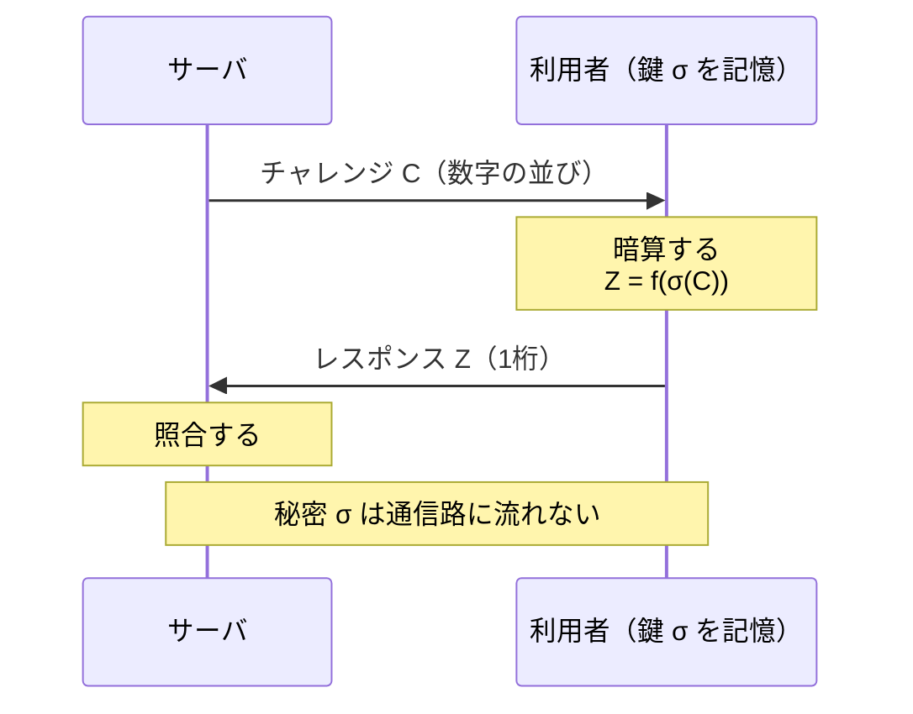

<div align="center">

# HCP × LLM

### 人間計算可能パスワードによる LLM の限界評価

**人間が暗算できるほど簡単なのに、機械には学習しにくい関数は存在するか。**

九州大学 工学部 電気情報工学科 櫻井研究室 ／ 卒業研究（令和8年度）

</div>

---

## どこから読むか

| あなたは | まずここへ |
|---|---|
| 🔰 **この研究を初めて見た** | 下の [3分でわかる](#3分でわかる) → [いまどこにいるか](#いまどこにいるか) |
| 📖 **内容を詳しく知りたい** | [docs/README.md](docs/README.md)（ドキュメント索引） |
| 🔬 **実験を動かしたい** | [動かす](#動かす) → [docs/cli_reference.md](docs/cli_reference.md) |
| 📊 **結果を見たい** | [docs/experiment_index.md](docs/experiment_index.md)（実験の一覧） |
| 🎓 **研究を引き継ぐ** | [docs/plan.md](docs/plan.md) → [docs/experiment_index.md](docs/experiment_index.md) → [docs/log.md](docs/log.md) |

---

## 3分でわかる

### 何を認証しているか

利用者は数字の表（**鍵** $\sigma$、10〜100マス）を覚えます。認証のたびに
**チャレンジ** $C$ が送られ、鍵を引きながら暗算して **レスポンス** $Z$ を返します。



秘密そのものは通信路に流れず、チャレンジは毎回変わります。
では攻撃者が $(C, Z)$ の組を大量に集めたら、鍵を復元できるのか。
**本研究はその攻撃者を LLM で代行させ、どこまで学習できるかを測ります。**

### 何が難しいのか

難しさは3つに分解できます。

| | 何をするか | 式 | 学習できるか |
|---|---|---|---|
| **① 記憶** | 鍵を1箇所引く | $Z = \sigma[C_0]$ | できる |
| **② 合成** | 複数箇所を引いて足す | $Z = \sigma[C_0] + \sigma[C_1] + \sigma[C_2]$ | できる（鍵による） |
| **③ 動的参照** | **引く場所を計算で決める** | $j = (\sigma[C_{10}] + \sigma[C_{11}]) \bmod 10$<br>$Z = \sigma[C_j] + \sigma[C_{12}] + \sigma[C_{13}]$ | **崩壊する** |

③の「**引く場所そのものを入力から計算する**」が壁になります。
この壁の正体を測ることが、本研究の中心です。

<details>
<summary>📐 扱っている関数の定義</summary>

原論文の人間計算可能関数 $f_{k_1,k_2}$ を使います。

$$j = \left(\sum_{i=10}^{9+k_1} X_i\right) \bmod 10, \qquad
Z = \left(X_j + \sum_{i=10+k_1}^{9+k_1+k_2} X_i\right) \bmod 10$$

$k_1$ は添字を作る項数、$k_2$ は末尾で足す項数で、入力は $10+k_1+k_2 = 14$ 個です。
安全性パラメータは $s(f) = \min\{(k_2+1)/2,\ k_1+1,\ 11\}$。

- 記号の定義 → [docs/hcp_background.md](docs/hcp_background.md)
- 実装（全35種の単一情報源） → [`src/hcp/algorithms.py`](src/hcp/algorithms.py)、`make algorithms` で一覧

</details>

---

## いまどこにいるか

> [!IMPORTANT]
> **測定系に交絡が見つかり、過去の結論の多くが保留中です。**
> 「正解率が偶然水準付近だから安全」という読み方が成り立たないことが分かりました。

### 分かったこと

| | 出所 |
|---|---|
| 評価50件では点推定が最大13ポイントずれ、実際に結論を誤らせた | 実験2 |
| 同じ関数・同じ条件でも、鍵を変えると正解率が **10.6% 〜 99.8%** に動く | 実験5b・6 |
| その正体は「**5エポックという予算の中で学習が離陸したか**」だった | 実験7 |
| 鍵もデータも乱数シードも同一でも、GPU の非決定性だけで離陸が1エポックずれる | 実験7 |

### これまでの歩み

| | 実験 | 内容 | いまその結論は |
|---|---|---|---|
| **7月** | 実験1 | 難易度ラダー（記憶・合成・動的参照） | 一部撤回 |
| **8月** | 実験2 | 動的参照の深さ | 保留 |
| | 実験3 | 動的参照の構造（1本／並列2本／直列2本） | 無効 |
| | 実験4 | 学習データ量 | 保留 |
| **9月** | 実験5 | 参照範囲（動的参照の強さを連続的に刻む） | 無効 |
| | 実験5b | 鍵を変えると結果が動く | 記述を修正 |
| | 実験6 | 鍵10本の分布 | 一部有効 |
| | 実験7 | 鍵の性質か run のばらつきか | **確定** |
| | 実験8a | 学習予算を外して測り直す | ◀ **いまここ** |

各実験の問い・結果・**いまその結論が生きているか**は
**[docs/experiment_index.md](docs/experiment_index.md)** にあります。

---

## ドキュメント

**入口は [docs/README.md](docs/README.md)** です。以下は主なものへの直通リンク。

<table>
<tr><td valign="top" width="50%">

**研究の内容**

- [認証の背景知識](docs/authentication_background.md)<br><sub>3分類・パスワードの限界・チャレンジレスポンス</sub>
- [HCP の前提知識](docs/hcp_background.md)<br><sub>記号・関数族・安全性パラメータ</sub>
- [研究室の卒論4本](docs/literature/lab_theses.md)<br><sub>MLP → LSTM → BiLSTM → CNN → 本研究</sub>
- [先行研究の要約](docs/literature/)<br><sub>Blocki ら・小川ら・加地ら</sub>

</td><td valign="top" width="50%">

**実験の道具**

- [LLM の学習の基礎](docs/llm_training_basics.md)<br><sub>事前学習・SFT・LoRA・損失・乱数</sub>
- [測定系の監査](docs/measurement_audit.md)<br><sub>学習予算が測定値を作っていた</sub>
- [コマンドライン引数](docs/cli_reference.md)<br><sub>既定値の落とし穴つき</sub>

</td></tr>
<tr><td valign="top">

**計画と記録**

- [研究計画](docs/plan.md)<br><sub>背景・問い・実験設計・評価指標</sub>
- [実験の一覧](docs/experiment_index.md)<br><sub>問い・結果・結論が生きているか</sub>
- [日誌](docs/log.md)<br><sub>新しい順</sub>
- [結果の置き場と歩き方](results/README.md)

</td><td valign="top">

**成果物**

- [卒論の章立てと素材](docs/thesis/README.md)
- [第1章 貢献の主張](docs/thesis/ch1_contribution.md)
- [週次報告](docs/reports/)<br><sub>Markdown が原本</sub>
- [報告書の書き方](docs/reports/README.md)

</td></tr>
</table>

---

## 動かす

```bash
make help        # コマンド一覧
make status      # 走行中バッチと進捗
make inventory   # どのパラメータで学習したかの棚卸し
make summarize   # 評価結果の集計
make algorithms  # 登録アルゴリズムを難易度の分解にそって一覧
make test        # アルゴリズム自己検証＋文面の非退行検査
```

<details>
<summary>⚙️ 環境構築</summary>

```bash
nix develop          # 通常のツール類（または direnv allow）

# 学習・評価（torch 系は nix develop に含まれないため .venv を使う）
python3 -m venv .venv && .venv/bin/pip install -r requirements.txt
```

GPU は 8GB を想定（QLoRA 4bit + LoRA r=16）。フル学習なら 34.8GB 要るところを
1.7GB で回しています → [数値精度とメモリ](docs/llm_training_basics.md)

</details>

実験の回し方と守るべき約束は **[CLAUDE.md](CLAUDE.md)**、引数の意味は
**[docs/cli_reference.md](docs/cli_reference.md)**、バッチの書き方は
**[experiments/batch/README.md](experiments/batch/README.md)** にあります。

---

## 構成

```
src/hcp/          研究の中核（algorithms.py が全35アルゴリズムの単一情報源）
src/baseline_ml/  従来ML（CNN等）ベースライン
experiments/      実験スクリプト（batch/ に夜間バッチ、done/ に実行済み）
tools/            補助ツール（status / list_algorithms / read_pdf / migrate）
tests/            文面の非退行検査（学習済みアダプタとの比較可能性を守る）
docs/             ドキュメント（索引: docs/README.md）
results/          実験結果（歩き方: results/README.md）
literature/       先行研究の PDF（Git 管理外。実体は Google Drive）
legacy/           旧実装（参照用、動作保証なし）
```
