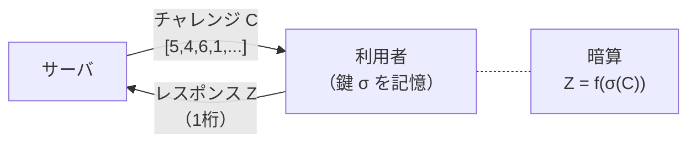
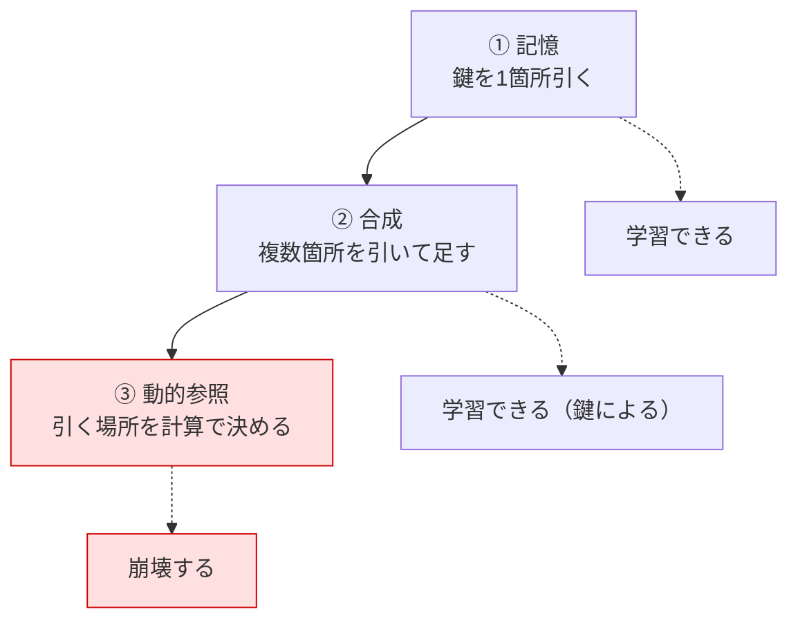

# HCP × LLM — 人間計算可能パスワードによる LLM の限界評価

九州大学 工学部 電気情報工学科 櫻井研究室 ／ 卒業研究（令和8年度）

**人間が暗算できるほど簡単なのに、機械には学習しにくい関数は存在するか。**
人間計算可能パスワード（HCP）を題材に、LLM がどこで解けなくなるのかを測る研究です。

> [!NOTE]
> **はじめて読む方へ** — [この研究は何か](#この研究は何か) → [いまどこにいるか](#いまどこにいるか)
> の順に読むと3分で概要がつかめます。詳しくは [docs/README.md](docs/README.md) が入口です。

---

## この研究は何か

利用者は10〜100マスの秘密の数表（**鍵** $\sigma$）を覚えます。認証のたびにサーバから
**チャレンジ** $C$（数字の並び）が送られ、利用者は鍵を引きながら暗算して
**レスポンス** $Z$（1桁の数字）を返します。秘密そのものは通信路に流れません。



攻撃者が $(C, Z)$ の組を大量に集めたら、鍵を復元できてしまうのか。
本研究はその攻撃者を **LLM** で代行させ、どこまで学習できるかを測ります。

**難しさは3つに分解できます。**



③の「引く場所そのものを計算で決める」（$X_j$ の $j$ を入力から作る）が壁になります。
**この壁の正体を測ることが、本研究の中心です。**

<details>
<summary>もう少し詳しく — 扱っている関数</summary>

原論文の人間計算可能関数 $f_{k_1,k_2}$ を使います。

$$j = \left(\sum_{i=10}^{9+k_1} X_i\right) \bmod 10, \qquad
Z = \left(X_j + \sum_{i=10+k_1}^{9+k_1+k_2} X_i\right) \bmod 10$$

$k_1$ は添字を作る項数、$k_2$ は末尾で足す項数で、入力は $10+k_1+k_2 = 14$ 個。
安全性パラメータは $s(f) = \min\{(k_2+1)/2,\ k_1+1,\ 11\}$。

記号の定義・関数の一覧は [docs/hcp_background.md](docs/hcp_background.md) に、
実装は [`src/hcp/algorithms.py`](src/hcp/algorithms.py)（全35種の単一情報源）にあります。
`make algorithms` で一覧できます。

</details>

---

## いまどこにいるか

> [!IMPORTANT]
> **測定系に交絡が見つかり、過去の結論の多くが保留中です。**
> 「正解率が偶然水準付近だから安全」という読み方が成り立たないことが分かりました。

| 分かったこと | 出所 |
|---|---|
| 評価50件では点推定が最大13ポイントずれ、実際に結論を誤らせた | 実験2 |
| 同じ関数・同じ条件でも、鍵を変えると正解率が 10.6% 〜 99.8% に動く | 実験5b・6 |
| その正体は「**5エポックという予算の中で学習が離陸したか**」だった | 実験7 |
| 鍵もデータも乱数シードも同一でも、GPU の非決定性だけで離陸が1エポックずれる | 実験7 |

いまは**予算を外して測り直している**ところです（実験8a、走行中）。


各実験の問い・結果・**いまその結論が生きているか**は
**[docs/experiment_index.md](docs/experiment_index.md)** にまとめてあります。

---

## ドキュメント

**[docs/README.md](docs/README.md) が入口です。** 以下は主なものへの直通リンク。

### まず読む

| | |
|---|---|
| [docs/README.md](docs/README.md) | ドキュメントの索引（目的別） |
| [docs/plan.md](docs/plan.md) | 研究計画 — 背景・問い・実験設計・評価指標 |
| [docs/experiment_index.md](docs/experiment_index.md) | 実験の一覧 — 問い・結果・結論が生きているか |

### 研究の内容

| | |
|---|---|
| [docs/authentication_background.md](docs/authentication_background.md) | 認証とは — 3分類・パスワードの限界・チャレンジレスポンス |
| [docs/hcp_background.md](docs/hcp_background.md) | HCP とは — 記号・関数族 $f_{k_1,k_2}$・安全性パラメータ |
| [docs/literature/lab_theses.md](docs/literature/lab_theses.md) | 研究室の卒論4本 — MLP → LSTM → BiLSTM → CNN → 本研究 |
| [docs/literature/](docs/literature/) | 先行研究の要約（Blocki ら・小川ら・加地ら） |

### 実験の道具

| | |
|---|---|
| [docs/llm_training_basics.md](docs/llm_training_basics.md) | LLM の学習の基礎 — 事前学習・SFT・LoRA・損失・乱数 |
| [docs/measurement_audit.md](docs/measurement_audit.md) | 測定系の監査 — 学習予算が測定値を作っていた |
| [docs/cli_reference.md](docs/cli_reference.md) | コマンドライン引数 — 既定値の落とし穴つき |

### 記録と成果物

| | |
|---|---|
| [docs/log.md](docs/log.md) | 日誌（新しい順） |
| [results/README.md](results/README.md) | 結果の置き場と歩き方 |
| [docs/thesis/README.md](docs/thesis/README.md) | 卒論の章立てと素材の対応表 |
| [docs/reports/](docs/reports/) | 週次報告（Markdown が原本） |

---

## 動かす

```bash
make help        # コマンド一覧
make status      # 走行中バッチと進捗
make inventory   # どのパラメータで学習したかの棚卸し
make summarize   # 評価結果の集計
make algorithms  # 登録アルゴリズムを難易度の分解にそって一覧
make test        # アルゴリズム自己検証＋文面の非退行検査
```

<details>
<summary>実験を1本回す</summary>

```bash
# 学習（約100分／1000件・5エポック）
.venv/bin/python experiments/train_finetuning.py \
  --model Qwen/Qwen2.5-3B-Instruct --algorithm func_22_k10 \
  --paradigm pure --stage 2 --n_shot 0 --n_train 1000 --epochs 5 \
  --key_seed 0 --data_seed 0

# 評価（学習時と同じ algorithm / stage / key_seed を指定すること）
.venv/bin/python experiments/run_eval.py --provider lora \
  --model <学習が出力した run ディレクトリ> --algorithm func_22_k10 \
  --stage 2 --n_shot 0 --n_test 500 --key_seeds 0 --data_seeds 0
```

引数の意味と既定値の落とし穴は [docs/cli_reference.md](docs/cli_reference.md) を参照。

</details>

<details>
<summary>バッチで回す（推奨）</summary>

```bash
# まず空実行で確認（GPU を掴まないので走行中のバッチがあっても安全）
HCP_DRY_RUN=1 bash experiments/batch/run_xxx.sh

# 本番。セッションを閉じても走り続ける
nohup bash experiments/batch/run_xxx.sh > results/logs/run_xxx.out 2>&1 & disown
tail -f results/logs/run_xxx.out
```

書き方と過去の実験は [experiments/batch/README.md](experiments/batch/README.md)。

</details>

> [!WARNING]
> **走行中のスクリプトは編集しないこと。** bash はバイト位置で逐次読むため、
> 行を足すと実行位置がずれて別の箇所が再実行されます（2026-09-12 に実際に発生）。
> 作業の約束は [CLAUDE.md](CLAUDE.md) にあります。

---

## 構成

```
src/hcp/          研究の中核（algorithms.py が全35アルゴリズムの単一情報源）
src/baseline_ml/  従来ML（CNN等）ベースライン
experiments/      実験スクリプト（batch/ に夜間バッチ、done/ に実行済み）
tools/            補助ツール（status / list_algorithms / read_pdf / migrate）
tests/            文面の非退行検査（学習済みアダプタとの比較可能性を守る）
docs/             ドキュメント（索引: docs/README.md）
results/          実験結果（歩き方: results/README.md）
literature/       先行研究の PDF（Git 管理外。実体は Google Drive）
legacy/           旧実装（参照用、動作保証なし）
```

<details>
<summary>環境構築</summary>

```bash
# 通常のツール類
nix develop          # または direnv allow

# 学習・評価（torch 系は nix develop に含まれないため .venv を使う）
python3 -m venv .venv && .venv/bin/pip install -r requirements.txt
```

GPU は 8GB を想定しています（QLoRA 4bit + LoRA r=16）。詳しくは
[docs/llm_training_basics.md](docs/llm_training_basics.md) の「数値精度とメモリ」。

</details>
