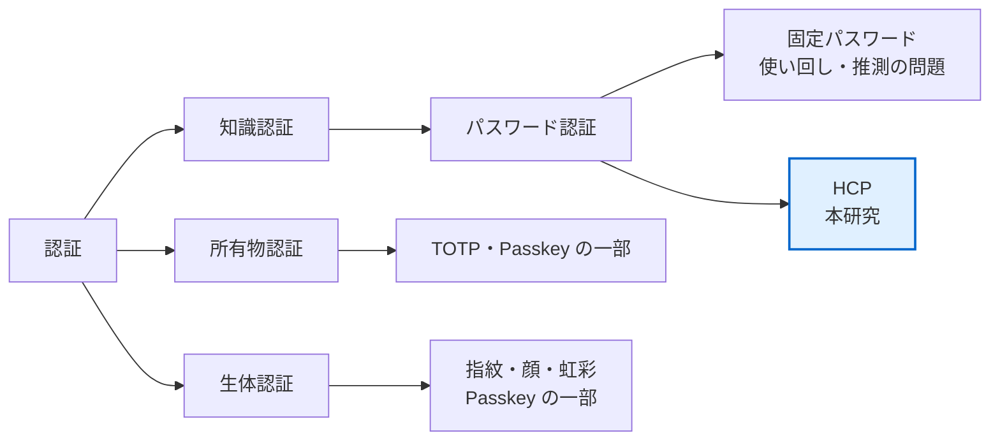

# 認証の背景知識

> 認証とは何か。卒論 第2章 2.1 の素材
>
> 📚 [ドキュメント索引](README.md) ／ 関連: [HCP の前提知識](hcp_background.md) ・ [卒論の章立て](thesis/README.md)

**卒論 第2章 2.1「認証」の素材．** 研究室の過去の卒論（R6 池田・R7 小川）が
第2章で書いている内容に型を合わせてある。HCP そのものの説明は
[hcp_background.md](hcp_background.md)（第3章の素材）に分けてある。

出典表記は仮。執筆時に一次資料へ当たり直すこと（下の「要確認」を参照）。

## 目次
- [認証とは](#認証とは)
- [認証の3分類](#認証の3分類)
- [パスワード認証](#パスワード認証)
- [パスワードの現状と問題](#パスワードの現状と問題)
- [チャレンジレスポンス認証](#チャレンジレスポンス認証)
- [パスワード認証を補う既存技術](#パスワード認証を補う既存技術)
- [HCP はどこに位置するか](#hcp-はどこに位置するか)
- [要確認](#要確認)

---

## 認証とは

オンラインサービスの普及により，個人が非対面で個人情報をやりとりする機会が増えた。
対面で相手を確認できない状況では，**通信している相手が本人であるか**を確かめる手続きが
欠かせない。これが**ユーザー認証**である。

認証は「識別（identification）」と区別される。識別は「誰であるか」を名乗ること
（ID の提示），認証は「本当にその人であるか」を確かめることを指す。

## 認証の3分類

認証に使う要素は3つに大別される。

| 分類 | 根拠 | 例 |
|---|---|---|
| **知識認証** | 本人しか知り得ない情報 | パスワード，暗証番号，秘密の質問 |
| **所有物認証** | 本人しか持っていない物 | 鍵，キャッシュカード，ワンタイムパスワードトークン |
| **生体認証** | 本人の生物学的特徴 | 指紋，顔，虹彩，声紋，静脈 |

複数を組み合わせるものを**多要素認証**という。

比較の尺度は主に3つ。**安全性**・**利便性**・**導入コスト**である。

- パスワードは導入コストが低く，どの端末でも使えるが，使い回しや推測により破られやすい
- 生体認証は方式によっては偽装が難しい（虹彩・静脈など）が，専用の装置が要る。
  また**生体情報は変更できない**ため，漏洩したときの回復手段が無い
- 所有物認証は紛失・盗難の risk を負う

## パスワード認証

知識認証の代表。ユーザーを特定する **ID** と，本人であることを示す秘密である
**パスワード**を組み合わせる。

安全性はパスワード文字列の複雑さに依存する。したがって

- 十分に長く，推測しにくい文字列であること
- サービスごとに異なる，互いに無関係な文字列であること

が求められる。しかし**この2つは人間の記憶能力と正面から衝突する**。

## パスワードの現状と問題

現実には次の状態にある。

- **使い回し**: 同じパスワードを複数のアカウントで使う。1つ漏れると芋づる式に破られる
  （**パスワードリスト攻撃**）
- **推測可能な文字列**: 氏名・誕生日・キーボードの並び順など，個人情報から
  類推できる文字列が使われる（**辞書攻撃**に弱い）
- **機械生成のランダム文字列は覚えられない**: 安全性を上げる手段として有効だが，
  記憶できないため紙に書く・使い回すなどの別の穴を生む

つまり**「安全なパスワード」と「覚えられるパスワード」は原理的にトレードオフ**にある。
この矛盾に対する一つの答えとして提案されたのが，人間計算可能パスワード（HCP）である。

## チャレンジレスポンス認証

**リプレイ攻撃**（一度成功した通信をそのまま再送する攻撃）に耐性を持つ認証方式。

パスワード認証では，認証のたびに秘密そのものを送る。通信路上で盗聴されれば
そのまま再利用されてしまう。チャレンジレスポンス認証では，

1. サーバがその都度異なる**チャレンジ**（問題）を送る
2. ユーザーは秘密を使って**レスポンス**（答え）を計算し，それだけを返す
3. サーバは同じ計算ができるかで本人性を確認する

**秘密そのものは通信路に流れない**。またチャレンジが毎回変わるため，過去の
レスポンスを再送しても通らない。

最も簡単な例は公開鍵暗号を用いた方式である。秘密鍵 $\mathrm{Sk}$ と
公開鍵 $\mathrm{Pk}$ について $\mathrm{Pk}(\mathrm{Sk}(A)) = A$ が成り立つことを使い，
サーバが送った乱数 $A$ に対して $\mathrm{Sk}(A)$ を返せるかどうかで認証する。

> [!NOTE]
> **HCP はチャレンジレスポンス認証の一種である．** ただし計算を機械ではなく
> **人間が暗算で行う**点が決定的に違う。したがって使える関数は「人間が暗算できる
> 程度に簡単」でなければならず，そのことが安全性の上限を決める。

## パスワード認証を補う既存技術

| 技術 | 仕組み | 位置づけ |
|---|---|---|
| **パスワードマネージャ** | ランダムなパスワードを生成・保管する | 記憶の問題を道具に外部化する。マスターパスワードと保管先に依存が集中する |
| **ワンタイムパスワード（TOTP）** | 共有秘密と現在時刻からその都度異なる値を生成 | 所有物認証。リプレイ攻撃に耐性 |
| **Passkey（FIDO）** | 端末内で秘密鍵・公開鍵を生成し，チャレンジレスポンスで認証 | 生体認証＋所有物認証。**サーバに秘密が保存されないため漏洩しない** |

> Passkey が普及しつつあるいま，「なぜまだパスワード方式を研究するのか」は
> 第1章で答えるべき問いである。素材としては，(a) Passkey は端末の所有が前提であり
> 端末を持たない・使えない状況をカバーしない，(b) 知識のみで完結する認証には
> 端末非依存という固有の価値がある，(c) HCP は認証そのものより
> **「人間には計算できるが機械には学習しにくい関数」という問いの器**として
> 価値がある，あたりが考えられる。**本研究は (c) の立場を取っている**
> （[plan.md](plan.md) の研究の枠組み）。

## HCP はどこに位置するか

HCP は**知識認証でありチャレンジレスポンス認証**でもある。秘密（鍵 $\sigma$）を
記憶し，チャレンジに対して暗算でレスポンスを返す。秘密そのものは送信されない。

これにより，冒頭のトレードオフに対して次の立場を取る。

- **覚えるのは1つの秘密だけ**（サービスごとに別の文字列を覚える必要がない）
- **通信路に流れるのはレスポンスのみ**（漏洩しても秘密そのものは分からない…はずである）

「はずである」が成り立つかどうかが安全性評価の問題であり，
チャレンジとレスポンスの組をいくつ集めれば秘密を復元できるかが問われる。
これが [hcp_background.md](hcp_background.md) 以降の話につながる。

## 要確認

執筆時に一次資料へ当たり直すべき箇所。

- 認証の3分類の出典（R6 池田は [16][17][3] を引いている。文献番号の実体を確認する）
- Passkey / FIDO の仕様の一次資料（FIDO Alliance の文書）
- パスワードの使い回し率など，現状を示す統計の出典と最新値
- リプレイ攻撃・辞書攻撃・パスワードリスト攻撃の定義の出典
- 「安全性と利便性のトレードオフ」を論じた標準的な文献
