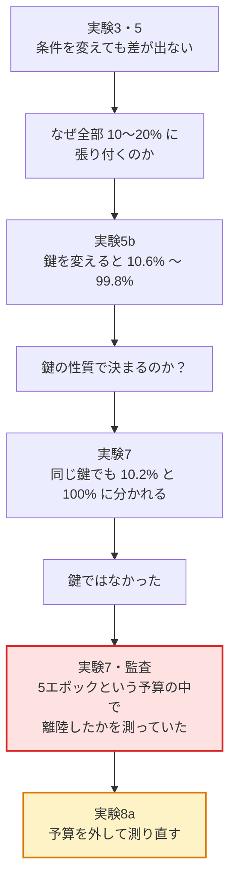

# 実験の一覧

> 実験1〜8の一覧。問い・結果・**いまその結論が生きているか**
>
> 📚 [ドキュメント索引](README.md) ／ 関連: [日誌](log.md) ・ [測定系の監査](measurement_audit.md) ・ [研究計画](plan.md)

> [!IMPORTANT]
> **「実験N」と「Stage 0〜3」は別物である．**
>
> - **実験N**（本ドキュメント）… **どの実験か**。実験1〜8の通し番号
> - **Stage 0〜3** … **プロンプトで何を開示するか**
>   （0: なし / 1: 鍵のみ / 2: ルールのみ / 3: ルール＋鍵をK個）
>
> 以前はどちらも「段階」と呼んでいて紛らわしかったため，2026-09-13 に
> 実験側を「実験N」へ改称した（旧ファイル名 `experiments.md`）。
> **ファインチューニングの実験はすべて Stage 2 である**
> — 重みに鍵を覚えさせるのが目的なので，プロンプトに鍵を書く Stage 1・3 は
> 原理的に使わない。Stage 3 は評価・学習とも0件で，経路A の未着手部分にあたる。

**「実験N」が何を指すかの正式な一覧．** これまで `docs/plan.md` §3.1.2，
`experiments/batch/README.md`，`experiments/inventory.py` の3箇所に分かれて
いたものを，ここに集約した．**実験を追加・改称するときはまずここを直す．**

- 実施の詳細と当日の考察 → [log.md](log.md)（日付順）
- 研究全体の位置づけ → [plan.md](plan.md) §3.1
- 回したスクリプト → [../experiments/batch/README.md](../experiments/batch/README.md)
- どの run がどの段階か → `make inventory`

「現在の評価」は 2026-09-13 時点のもの．**測定系に2つの交絡が見つかったため，
実験2〜6 の結論の多くは保留または撤回されている．**経緯は
[measurement_audit.md](measurement_audit.md)（学習予算）と実験5b・6・7 を参照．

---

## 目次

- [一覧](#一覧)
- [各段階](#各段階)
- [新しい実験を設計したら，回す前に見直す](#新しい実験を設計したら回す前に見直す)
- [これまでに確定した方法論上の規則](#これまでに確定した方法論上の規則)

## 交絡はどう見つかったか

結論が次々と保留になった経緯は，1本の連鎖になっている。

詳しくは [measurement_audit.md](measurement_audit.md)。

## 一覧

| 段階 | 時期 | 問い | 結果 | 現在の評価 |
|---|---|---|---|---|
| **1** | 2026-06〜07 | 記憶・合成・動的参照のどれが壁か | 記憶と合成は学習できる．動的参照で崩壊 | **一部撤回**（鍵を揃えていない比較だった） |
| **2** | 08/16〜08/18 | 動的参照の**深さ**を増やすと難しくなるか | 深さ1↔2に差なし，深さ3のみ両鍵で高い | **保留**（1条件1run） |
| **3** | 08/23 | 動的参照の**本数と依存構造**（1本/並列2本/直列2本） | 差なし．ただし全6条件が10〜20%の床 | **無効**（鍵1は静的でも不動の鍵） |
| **4** | 08/23〜08/24 | **学習量**を増やせば床から出るか | 1000/3000/5000件で 13.0/12.2/12.6% | **保留**（鍵1のみ） |
| **5** | 09/02 | 動的参照の**強さ**を連続的に刻めるか（`narrowptr`） | 勾配なし．静的端点 $m=1$ すら 9.8% | **無効**（端点が機能せず） |
| **5b** | 09/05〜09/06 | 静的端点が離陸しないのはなぜか | 鍵だけ変えると 99.6% / 26.2% / 10.6% | **記述が誤り**（鍵の効果ではなかった） |
| **6** | 09/09〜09/10 | 鍵の効果はどこまで大きいか | 鍵10本で二峰性．同じ鍵で静的99.6% vs 動的20.0% | **鍵の効果は撤回**．静的vs動的の対比は有効 |
| **7** | 09/12〜09/13 | 鍵の性質か，run のばらつきか | 鍵6が 10.2% / 100.0% / 96.2% | **確定**．測っていたのは「離陸したか」 |
| **8a** | 09/13〜09/14 | 予算を外せば動的参照は離陸するか | 静的は離陸（10.2%→100%）。動的は2本とも汎化せず，1本は丸暗記に流れた | **確定** |
| **8b** | 09/17〜09/18 | 参照範囲のどこで学習できなくなるか | 段階1: m=1 は 98.6%，m=2 は 9.2%。**壁は最小の刻みにあった** | 段階1完了 |
| **9** | 09/19〜 | 課題を極小にしても動的参照は学習されないか | — | **設計完了・未実施** |

---

## 各段階

### 実験1: 難易度ラダーの探索（2026-06〜07）

**問い**: func_22 の困難は何に由来するのか．

①記憶（`lookup_k*`）②合成（`table_add_k*`）③動的参照（`pointer_k*`, `func_22`）に
分解し，QLoRA と CNN を同一データ量で比較した．統制実験として動的参照を持たない
`table_add3_k10` も回した．

**当時の結論**: 記憶と合成は学習できる（データ量で解決する）．動的参照を含むと崩壊し，
データを5倍にしても改善しない．

**現在**: 強い主張1（記憶）は変更なし．強い主張2（合成）は**鍵による**
（同じ `table_add3_k10` が鍵によって 10.6%〜99.8%）．中程度の主張
（`pointer_k10` 34% vs `table_add3_k10` 100%）は**撤回** — 鍵を揃えていない比較だった．
詳細は [plan.md](plan.md) §3.1 と §3.1.2．

> [!NOTE]
> **番号の経緯**: この実験だけ番号が後づけである。当時は通し番号を付けておらず，
> 8月に深さラダーを2番と呼び始めたことで遡って1が空いた。
>
> なお7月には別系統の「段階3 / 段階3b」という呼び方があり，8月以降の番号と
> 衝突していた（同じ「段階3」が7月は難易度ラダー，8月は構造ラダーを指していた）。
> 2026-09-13 の改称でこれを解消し，7月分は本実験の内訳として
> **実験1a**（難易度ラダー × CNN 同条件比較，07/17）・
> **実験1b**（崖の細分化と露出回数仮説の検証，07/18）とした。

### 実験2: 深さラダー（08/16〜08/18）

**問い**: 動的参照の**深さ**（参照の連鎖）を増やすと単調に難しくなるか．
指導教員の指示（#pointer chasing）による．

`pointer_chain_k{k}_d{depth}` を実装．depth=1 は既存 `pointer_k` と等価．

**結果**: 深さ1↔2は両鍵でほぼ一致，深さ3のみ両鍵で約8ポイント高い（予測と逆）．
副産物として2つの発見があった．

- **不動点**: `pointer_chain` は $`j \leftarrow \text{鍵}[X_j]`$ を反復するため，
  $`\text{鍵}[X_j] = j`$ に落ちると吸収される．深さ3で 216/216 が退化していた．
  末尾に足し算がある（$`k_2 \gt 0`$）関数はこの欠陥を持たない
- **鍵ヒストグラムの漏洩**: $`k_2 = 0`$ の関数では答えが必ず鍵のセル値になるため，
  最頻値を答え続けるだけで16〜30%が出る．偶然水準（10%）ではなく
  **鍵ごとの最頻値基準線**と比べる必要がある

**方法論上の教訓**: 評価50件では点推定が最大13ポイントずれ，結論を実際に誤らせた．
**n_test=500 を標準とする**．

**現在**: 各条件1runのため保留．

### 実験3: 構造ラダー（08/23）

**問い**: 動的参照の**本数と依存構造**が効くか．

`func_22_k10`（1本）/ `dualptr_k10`（並列2本）/ `recptr_k10`（直列2本）× 鍵2本．

**結果**: 有意差なし（Fisher $p = 0.118$〜$0.581$）．ただし**全6条件が 10〜20% の床**で，
基準線の時点で既に床だった．下がる余地が無く識別できない．

**現在**: **無効**．鍵1・鍵2で測っており，実験5b で鍵1は静的参照ですら不動の鍵だと
判明した．「差が無い」は動的参照の性質ではない．

### 実験4: 学習量スイープ（08/23〜08/24）

**問い**: 学習データを増やせば床から出るか．

`func_22_k10`（鍵1）を 1000 / 3000 / 5000 件．

**結果**: 13.0% / 12.2% / 12.6%（Fisher $p = 0.92$）．まったく動かなかった．

**現在**: **保留**．鍵1のみで測定しており，その鍵は静的でも不動．
ただし「ステップ数を5倍にしても動かなかった」こと自体は事実である．

### 実験5: 参照範囲ラダー（09/02）

**問い**: 動的参照の強さを**連続的に刻めば**勾配が測れるか．

`narrowptr_k10_m{m}`: $`j = (X_{10}+X_{11}) \bmod m`$，$`Z = (X_j + X_{12} + X_{13}) \bmod 10`$．
$m=1$ は静的参照，$m=10$ は `func_22_k10` と完全に一致する．

**結果**: 勾配は出ず．**100%側の端点として設計した $m=1$ が 9.8%** で，設計の前提が崩れた．

**現在**: **無効**．端点の根拠にした7月の `table_add3_k10` の100%は key_seed=0 かつ
評価50件の1点で，鍵を揃えていなかった．

> ただし**ラダーの設計自体は有効**である．$m=1$ という「必ず離陸する端点」を
> 構造内に持つため，実験8b で主軸に据える．

### 実験5b: 静的端点の検証（09/05〜09/06）

**問い**: $m=1$ が離陸しないのは「mod 1」という表記のせいか，鍵のせいか．

7月と同じ `table_add3_k10`（「mod 1」を含まない）を鍵だけ変えて実行．

**結果**: ks=0 → 99.6% / ks=2 → 26.2% / ks=1 → 10.6%（$\chi^2$ $p = 1.6\times10^{-198}$）．
表記は原因ではなかった．

**現在**: **記述が誤り**．当時は「学習できるかは鍵で決まる」と結論したが，
実験7 でこれが再現しないことが判明した．正しくは「離陸が5エポック以内に
起きたかどうか」である．

### 実験6: 鍵の交絡（09/09〜09/10）

**問い**: (A) 学習可能な鍵の上で動的参照はどうなるか (B) 鍵の効果はどんな分布か．

**結果(A)**: ks=0（静的が99.6%学習できる鍵）の上で `func_22_k10` は 20.0%
（Fisher $p = 4.6\times10^{-179}$）．**同じ鍵の上で初めて公平に比較できた**．

**結果(B)**: 鍵10本の分布は二峰性（3本が96.8〜99.8%，7本が10.2〜33.6%）．
鍵の統計量（異なる数字の数・エントロピー・最長連）では説明できない．

**現在**: (B) の「鍵が決める」は**撤回**（実験7）．(A) の静的 vs 動的の対比は
固定予算下の比較として**有効**だが，「動的参照は学習できない」とまでは言えない．

### 実験7: seed ばらつきの検証（09/12〜09/13）

**問い**: 鍵の性質なのか，run のばらつきなのか．

鍵を固定して `data_seed` だけを変えた（ks=3, 6 × ds=1, 2）．

**結果**:

| 鍵 | ds=0 | ds=1 | ds=2 | 離陸エポック |
|---|---|---|---|---|
| 3 | 99.8% | 99.0% / 100.0% | 98.2% | 1 / 3・2 / 4 |
| 6 | **10.2%** | **100.0%** | **96.2%** | - / 1 / 4 |

**現在**: **確定**．鍵6 の 10.2% は外れくじだった．離陸エポックは1〜4にばらつき，
鍵6/ds=0 だけが5エポック以内に間に合わなかった．**測っていたのは関数の難しさではなく
「5エポックという予算の中で離陸が起きたか」だった．**

バッチ事故により同一条件の反復が偶然できた（ks=3/ds=1）．`key_seed`・`data_seed`・
学習シードがすべて同一でも離陸が ep2 と ep3 に分かれた．残る違いは GPU の
非決定性のみ．

### 実験8a: 学習予算の探り（09/13〜09/14）

**問い**: 予算を外せば動的参照は離陸するのか．

20エポック（2500ステップ）・定数学習率・評価500件．
スクリプト: `experiments/batch/run_budget_probe.sh`

| | 条件 | 5エポック時 | 20エポック | 検証損失の推移 |
|---|---|---|---|---|
| (B) | `table_add3_k10` 鍵6 | 10.2%（不動） | **100.0%** | 3エポック目で離陸し 0.0001 まで収束 |
| (A1) | `func_22_k10` 鍵0 seed42 | 20.0% | **11.4%** | 20エポック通して 0.19 前後で不動（学習損失も不動） |
| (A2) | `func_22_k10` 鍵0 seed1 | — | **23.6%** | 12エポックまで 0.19→0.17 と微減，以降は学習損失が 0.0002 まで落ち検証損失は 0.39 まで上昇 |

**結果**:

- **(B) により「5エポックという予算が測定器だった」という診断が実証された．**
  同じ鍵・同じデータで，5エポック（線形減衰）では不動だった条件が 100% になった。
  3エポック目で離陸しているので，時間的には5エポックでも足りていたはずであり，
  線形減衰で学習率が先に絞られていたことも効いている。
- **動的参照は，静的参照の4倍以上の予算を与えても汎化としては離陸しなかった（2本とも）．**
  ただし2本の中身は異なる。A1 は完全に不動で，衝突確率 10.3% と区別できない（二項検定 p = 0.23）。
  A2 は学習データ1000件を**丸暗記**した：学習損失が 0 に近づく一方で検証損失は
  上昇しており，典型的な過学習である。最終の正解率 23.6% は偶然水準より有意に高い
  （p = 9.1e-18）が，これは過学習に入る前の部分的な汎化の名残と考えられる
  （保存されるのは最終エポックの重み）。
- 同じ鍵・同じデータで静的 100% 対 動的 11.4%／23.6%（Fisher p = 2.2e-170）。

**解釈**: この予算と学習データ量では，動的参照の規則を学ぶより
1000件の入出力を丸暗記する方が最適化にとって容易である。A2 は9エポック目に学習損失が
0.59 へ跳ねており，減衰の無い定数学習率による不安定化も起きている。

**残る留保**: 2シードのみ。学習データを増やせば丸暗記の逃げ道が狭まり汎化に向かう
可能性は，この実験では検証していない（実験4 は5エポックでデータを増やしたが，予算が
律速していた可能性がある）。

### 実験8b: 参照範囲ラダー（09/17〜，実施中）

**問い**: 静的参照（離陸する）と m=10（離陸しない）の間で，どこから学習できなくなるか．

条件は実験8a と同一（鍵0・20エポック・定数学習率・評価500件・衝突確率 10.3%）。

#### 段階1（09/17〜09/18，seed42）

| m | 行き先の数 | 正解率 | 検証損失 | 離陸 |
|---|---|---|---|---|
| 1 | 1（実質は静的参照） | **98.6%** | 最小 0.0004 | ep5 で離陸 |
| 2 | 2 | **9.2%** | 最小 0.1777（ep10），最終 0.1931 | **せず** |
| 10 | 10（`func_22_k10`，実験8a） | 11.4% ／ 23.6% | — | せず |

- **壁はラダーの最小の刻みにあった．** m=1 と m=2 の差は Fisher の正確検定で
  p = 7.0e-218。m=2 は衝突確率 10.3% と区別できない（片側二項検定 p = 0.81）。
- m=2 の j は 0 か 1 のどちらかで，**動的参照としては1ビット**でしかない。
  それでも 20エポック（静的の4倍の予算）で学習されなかった。
- m=1 が 98.6% で離陸したことにより，**「mod 1」というルール文の書き方は
  原因ではない**ことも確かめられた（実験5 で崩れた端点の検証）。
- m=2 は学習損失も 0.19 前後で動いておらず，実験8a の A2 のような丸暗記にも
  至っていない。最適化が始まっていない。

**既出／未出の内訳（09/19 追加，[`tools/seen_unseen.py`](../tools/seen_unseen.py)）**

$`m=1`$ は答えを決める位置が $`X_0, X_{12}, X_{13}`$ の3つしかないため，
組み合わせは 1,000 通りしかなく，学習1000件が 640 通りを覆っていた。

| | 件数 | 正解率 |
|---|---|---|
| $`m=1`$ 既出 | 314 | 100.0% |
| $`m=1`$ **未出** | 186 | **96.2%** |
| $`m=2`$ 未出 | 500 | 9.2%（既出は0件） |

**$`m=1`$ の 98.6% は丸暗記ではない。**未出だけでも 96.2% あり，規則を学んでいる。
$`m=2`$ は組み合わせが 1,000,000 通りあるため既出が0件で，全件が未出の値である。

**留保**: 各条件1回のみ。壁の位置は整数の刻みではこれ以上細かくできないので，
段階2 では m を増やすのではなく**再現性**を確かめる。

### 実験9: 最小課題（09/19〜，未実施）

**問い**: 「3B が小さいから学習できなかった」という説明を排除できるか．

7B への切り替えは 8GB の GPU に 28 MiB 足りず断念した（[log.md](log.md) 09/19）。
モデルを大きくする代わりに**課題を小さくする**。鍵を 10 マス → 4 マスに縮めると，
答えを決める組み合わせが 1,000,000 通り → 4,096 通り（**1/244**）になる。

条件は実験8b と同一（20エポック・定数学習率・評価500件・seed42）。
違うのは鍵サイズと鍵だけである。

| | 実験8b 段階1 | 実験9 段階1 |
|---|---|---|
| 鍵サイズ | 10 マス | **4 マス** |
| 鍵 | seed 0 | seed 35 `[1,3,8,4]` |
| 衝突確率 | 10.5% | **10.8%** |
| 最頻値 | 13.0% | 14.0% |
| 関連する組合せ（$`m=2`$） | 1,000,000 | **4,096** |

**基準線が揃っているため，8b の m=1 98.6% / m=2 9.2% とそのまま並べられる。**

#### 鍵を選ぶ必要がある

$`k=4`$ では鍵100本の実測で次が分かっている。

- 4マスの**偶奇が揃う**と $`j=(X_{10}+X_{11}) \bmod 2`$ が 0 に固定され，
  動的参照が消えて静的課題に化ける（100本中12本）
- 値に**重複**があると答えが偏り，衝突確率が 10.5% → 16.7% に上がる

seed 35 は4値すべて相異なり偶奇も混ざるため，どちらも回避できる。

#### この設計の弱点

$`k=4`$ では組み合わせが少ないため，**学習1000件が評価を覆ってしまう**。

| | 関連する組合せ | 評価500件のうち既出 |
|---|---|---|
| $`m=1`$（対照） | 1,024 | **約62%** |
| $`m=2`$（測定） | 4,096 | 約22% |

ここでの「既出」は14個の入力そのものではなく（$`4^{14}`$ なのでまず重複しない），
答えを決める位置の組が既出という意味である。
したがって **$`m=1`$ が高得点でも丸暗記を排除できない**。
評価後に既出／未出に分けて正解率を出し，両方を記録する。

#### 縮小はここで止める

$`k=3`$ 以下は衝突確率が 16.2% 以上に歪み，8b と比較できない。
**$`k=4`$ が下限であり，ここで失敗してもこれ以上は縮めない。**
次に疑うのは規模ではなく手法である。作法と停止条件は
[plan.md](plan.md) §3.1.3 に回す前に明記した。

---

## 新しい実験を設計したら，回す前に見直す

**設計を1回書いて終わりにしない．** 書いたあとに必ず下のチェックを通してから
GPU を回す。実験8a では，この見直しで2つの穴が見つかった
（学習率が線形減衰のままで離陸ステップ数が予算に依存していた／
実験7 の直後なのに1条件1runのままだった）。

見直しは下の「方法論上の規則」を1項目ずつ当てるだけでよい．
規則はすべて実際に失敗して得たものなので，チェックリストとして機能する．

| 確認 | 出所 |
|---|---|
| 評価は500件になっているか | 実験2 |
| 偶然水準ではなく鍵ごとの基準線と比べる設計か | 実験2 |
| 基準線が**この実験の中に**あるか．先に回す順序か | 実験3 |
| 床にいる可能性を考えたか．差が出なかったとき何が言えるか | 実験3 |
| 鍵を複数引いているか | 実験5b |
| 1条件1runになっていないか | 実験7 |
| エポック数・学習率スケジュールが測定値に混ざっていないか | 実験7 |
| 過去の値と比較するなら，条件は揃っているか．揃わないなら基準線を実験内に作ったか | 実験5b・6 |

加えて，毎回問い直すべきこと．

- **どう転んでも報告できるか．** 「差が出たら〇〇、出なかったら××」と両方書けるか
- **一番情報量の多い条件を先に回しているか．** 途中で打ち切っても判断できるように
- **予算は妥当か．** 1本の所要時間 × 本数を計算したか

## これまでに確定した方法論上の規則

段階を重ねる中で判明し，**以降の全実験に適用する**もの．

1. **評価は 500 件**（実験2）．50件では点推定が最大13ポイントずれ，結論を誤らせた
2. **偶然水準ではなく鍵ごとの基準線と比べる**（実験2）．衝突確率 $`\sum p_i^2`$ と最頻値
3. **基準線を最初に測る**（実験3）．後回しにすると「差が無い」のか「識別できない」のか区別できない
4. **床にあるとき「差が無い」は効果の否定にならない**（実験3）
5. **鍵を複数引いて分布で比較する**（実験5b）．鍵1〜2本での条件間比較は解釈できない
6. **1条件1runで結論を出さない**（実験7）．設定を完全に固定しても離陸は1エポックぶれる
7. **固定エポックは予算の宣言であり，測定器になる**（実験7）．難易度を測るなら収束まで回す
8. **500件評価の前に検証損失を見る**（実験6）．鍵10本で正解率を完全に順位づけ，学習中に無料で取れる

---

## 次に読む

| | |
|---|---|
| [測定系の監査](measurement_audit.md) | なぜ多くの結論が保留になったのか |
| [日誌](log.md) | 各実験の当日の記録 |
| [研究計画](plan.md) | 全体の位置づけ |

📚 [ドキュメント索引](README.md) へ戻る
