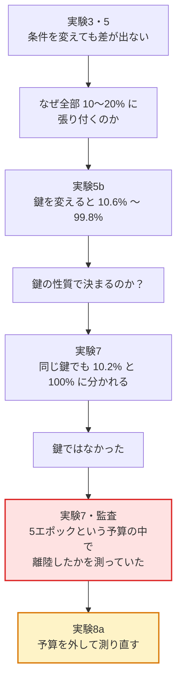

# 実験の一覧

> 実験1〜8の一覧。問い・結果・**いまその結論が生きているか**
>
> 📚 [ドキュメント索引](README.md) ／ 関連: [日誌](log.md) ・ [測定系の監査](measurement_audit.md) ・ [研究計画](plan.md)

> [!IMPORTANT]
> **「実験N」と「Stage 0〜3」は別物である．**
>
> - **実験N**（本ドキュメント）… **どの実験か**。実験1〜8の通し番号
> - **Stage 0〜3** … **プロンプトで何を開示するか**
>   （0: なし / 1: 鍵のみ / 2: ルールのみ / 3: ルール＋鍵をK個）
>
> 以前はどちらも「段階」と呼んでいて紛らわしかったため，2026-09-13 に
> 実験側を「実験N」へ改称した（旧ファイル名 `experiments.md`）。
> **ファインチューニングの実験はすべて Stage 2 である**
> — 重みに鍵を覚えさせるのが目的なので，プロンプトに鍵を書く Stage 1・3 は
> 原理的に使わない。Stage 3 は評価・学習とも0件で，経路A の未着手部分にあたる。

> [!TIP]
> **実験ごとの結果の数値**は `make inventory` が生成する
> [`results/inventory.md`](../results/inventory.md) にある（条件と結末だけの表）。
> 本ドキュメントは**問いと解釈**，向こうは**数値**という分担である。

**「実験N」が何を指すかの正式な一覧．** これまで `docs/plan.md` §3.1.2，
`experiments/batch/README.md`，`experiments/inventory.py` の3箇所に分かれて
いたものを，ここに集約した．**実験を追加・改称するときはまずここを直す．**

- 実施の詳細と当日の考察 → [log.md](log.md)（日付順）
- 研究全体の位置づけ → [plan.md](plan.md) §3.1
- 回したスクリプト → [../experiments/batch/README.md](../experiments/batch/README.md)
- どの run がどの段階か → `make inventory`

「現在の評価」は 2026-09-13 時点のもの．**測定系に2つの交絡が見つかったため，
実験2〜6 の結論の多くは保留または撤回されている．**経緯は
[measurement_audit.md](measurement_audit.md)（学習予算）と実験5b・6・7 を参照．

---

## いま言えること（2026-09-22）

**実験の履歴を追う前に，ここだけ読めばよい。**個々の実験が何をしたかは下の一覧に，
数値の分布は `make corpus` にある。

### 固い（検証に耐えた）

| | 主張 | 根拠 |
|---|---|---|
| 1 | **「動的参照を含む関数は学習できない」は誤り** | `narrowptr_k4_m2` が未出399件すべて正解（実験9） |
| 2 | **測定条件だけで結論が反転する** | 鍵・データ・シード固定で 10.2% → 100.0%（実験8a） |
| 3 | **正解率は「収束したか」をほぼそのまま写す** | 最小検証損失 0.02 を境に，90%以上か否かが60件すべてで一致 |
| 4 | **予算が収束時刻の分布を打ち切っていた** | 20エポックで回した8本中2本は収束が5エポック目より後 |
| 5 | **同じ予算では，動的参照でも規模でもなく足す個数が結果を分ける** | 動的740通り=63.8〜100% 対 静的56通り=11.8%（実験9 段階3） |

→ **3と4から，「偶然水準だから安全」という推論は成り立たない。**これが第一貢献。

→ **5により，「動的参照が壁」も「課題の規模が壁」も否定された。**ポインタを含み
場合の数が13倍多い課題（740通り，63.8〜100%）が，静的で小さい課題
（56通り，11.8%）より学習できている。違いは足す個数だけである。
**予算を固定した比較なので交絡を受けない。**

> [!CAUTION]
> **「5項は学習できない」とは言えない。**5項が失敗したときの検証損失の形
> （20エポック平坦）は，本研究が4回誤った推論と同じ signature を持つ。
> `table_add3_k10` 鍵6 は5エポックで平坦だったが20エポックで 100% になった。
> 予算を変えても差が残るかは**未検証**である。

### 暫定（証拠が足りない）

| | 主張 | 足りないもの |
|---|---|---|
| 6 | 足す個数が要因である | **予算を変えても差が残るかが未検証。**各1run。項数3も未測定 |

### 撤回

| 撤回するもの | 出所 |
|---|---|
| 「③動的参照で崩壊する」 | 実験1 |
| 「壁は参照範囲の最小の刻みにあった」 | 実験8b |
| 「壁は項数と空間の2軸」 | 09/19 の記述。規模は効いていなかった |
| **「正解率は二値である」** | **09/20 の記述。翌日 63.8% の中間例が出た** |

### 未解決

- **なぜ5項で崖が立つのか。**鍵4マスなら値は4種類しかなく，5個足すだけである
- 動的参照が**難しさを増す**かどうか ── $`m=2`$ がシードで割れた（100.0% / 63.8%）
  のは示唆的だが，場合の数が揃っていない（実験10 で測る）
- **実用的な鍵サイズ**で壁になるかどうか ── 鍵4マスの成功は $`n=26`$ の安全性を何も言わない
- 測定器だったのは**予算か学習率スケジュールか**（実験11 で分離する）

---

## 目次

- [いま言えること](#いま言えること2026-09-20)
- [一覧](#一覧)
- [各段階](#各段階)
- [新しい実験を設計したら，回す前に見直す](#新しい実験を設計したら回す前に見直す)
- [これまでに確定した方法論上の規則](#これまでに確定した方法論上の規則)

## 交絡はどう見つかったか

結論が次々と保留になった経緯は，1本の連鎖になっている。


```mermaid
flowchart TD
    A["実験3・5<br/>条件を変えても差が出ない"] --> B["なぜ全部 10〜20% に<br/>張り付くのか"]
    B --> C["実験5b<br/>鍵を変えると 10.6% 〜 99.8%"]
    C --> D["鍵の性質で決まるのか？"]
    D --> E["実験7<br/>同じ鍵でも 10.2% と 100% に分かれる"]
    E --> F["鍵ではなかった"]
    F --> G["実験7・監査<br/>5エポックという予算の中で<br/>離陸したかを測っていた"]
    G --> H["実験8a<br/>予算を外して測り直す"]
    style G fill:#fee2e2,stroke:#dc2626,stroke-width:2px
    style H fill:#fef3c7,stroke:#d97706,stroke-width:2px
```

詳しくは [measurement_audit.md](measurement_audit.md)。

## 一覧

| 段階 | 時期 | 問い | 結果 | 現在の評価 |
|---|---|---|---|---|
| **1** | 2026-06〜07 | 記憶・合成・動的参照のどれが壁か | 記憶と合成は学習できる．動的参照で崩壊 | **一部撤回**（鍵を揃えていない比較だった） |
| **2** | 08/16〜08/18 | 動的参照の**深さ**を増やすと難しくなるか | 深さ1↔2に差なし，深さ3のみ両鍵で高い | **保留**（1条件1run） |
| **3** | 08/23 | 動的参照の**本数と依存構造**（1本/並列2本/直列2本） | 差なし．ただし全6条件が10〜20%の床 | **無効**（鍵1は静的でも不動の鍵） |
| **4** | 08/23〜08/24 | **学習量**を増やせば床から出るか | 1000/3000/5000件で 13.0/12.2/12.6% | **保留**（鍵1のみ） |
| **5** | 09/02 | 動的参照の**強さ**を連続的に刻めるか（`narrowptr`） | 勾配なし．静的端点 $m=1$ すら 9.8% | **無効**（端点が機能せず） |
| **5b** | 09/05〜09/06 | 静的端点が離陸しないのはなぜか | 鍵だけ変えると 99.6% / 26.2% / 10.6% | **記述が誤り**（鍵の効果ではなかった） |
| **6** | 09/09〜09/10 | 鍵の効果はどこまで大きいか | 鍵10本で二峰性．同じ鍵で静的99.6% vs 動的20.0% | **鍵の効果は撤回**．静的vs動的の対比は有効 |
| **7** | 09/12〜09/13 | 鍵の性質か，run のばらつきか | 鍵6が 10.2% / 100.0% / 96.2% | **確定**．測っていたのは「離陸したか」 |
| **8a** | 09/13〜09/14 | 予算を外せば動的参照は離陸するか | 静的は離陸（10.2%→100%）。動的は2本とも汎化せず，1本は丸暗記に流れた | **確定** |
| **8b** | 09/17〜09/18 | 参照範囲のどこで学習できなくなるか | 段階1: m=1 は 98.6%，m=2 は 9.2%。**壁は最小の刻みにあった** | 段階1完了 |
| **9** | 09/19〜09/21 | 課題を極小にしても動的参照は学習されないか／壁は何か | 動的参照は学習された。同じ予算では**足す個数**が結果を分ける（動的でも規模でもない） | 段階3まで完了 |
| **10** | 09/20〜 | 動的参照は難しさに寄与するのか（場合の数を揃え，収束エポックで比べる） | — | **設計完了・未実施** |
| **11** | 09/20〜 | 測定器だったのは予算か，学習率スケジュールか | — | **設計完了・未実施** |
| **12** | 09/23〜09/24 | 素朴な手順の誤判定はどれだけ起きるか（偽陰性の再現率） | 8条件中2件が反転（いずれも `table_add3_k10`）。反転は**学習可能性の境界にある条件でしか起こらない** | **完了**（族をまたぐ一般化は不可） |
| **13** | 09/26 | 経路Aの基準線: $`s(f)`$ の3点で $`m^*_{\text{info}}`$ を確定する | $`s(f)`$ が 1.0/1.5/2.0 と変わっても中央値は3点とも **11**（$`\approx 1.1n`$）。ばらつきの 77〜85% は鍵ではなく**観測の引き** | **完了**（$`n=10`$。$`n=26`$ は関数により可否が分かれる） |
| **A1** | 09/27 | 動的参照は in-context 推論でも壁になるか（小川ら CNN の3世代目） | $`j`$ 項ありは判定可能8件すべて失敗。$`n=6`$ 鍵5本で 統制① 4/5・統制② 2/5・$`j`$項 **0/3**。**効果の順序は言えるが，文面の効果はゼロと言えない** | **第1段完了**（$`n \le 8`$） |

---

## 各段階

### 実験1: 難易度ラダーの探索（2026-06〜07）

**問い**: func_22 の困難は何に由来するのか．

①記憶（`lookup_k*`）②合成（`table_add_k*`）③動的参照（`pointer_k*`, `func_22`）に
分解し，QLoRA と CNN を同一データ量で比較した．統制実験として動的参照を持たない
`table_add3_k10` も回した．

**当時の結論**: 記憶と合成は学習できる（データ量で解決する）．動的参照を含むと崩壊し，
データを5倍にしても改善しない．

**現在**: 強い主張1（記憶）は変更なし．強い主張2（合成）は**鍵による**
（同じ `table_add3_k10` が鍵によって 10.6%〜99.8%）．中程度の主張
（`pointer_k10` 34% vs `table_add3_k10` 100%）は**撤回** — 鍵を揃えていない比較だった．
詳細は [plan.md](plan.md) §3.1 と §3.1.2．

> [!NOTE]
> **番号の経緯**: この実験だけ番号が後づけである。当時は通し番号を付けておらず，
> 8月に深さラダーを2番と呼び始めたことで遡って1が空いた。
>
> なお7月には別系統の「段階3 / 段階3b」という呼び方があり，8月以降の番号と
> 衝突していた（同じ「段階3」が7月は難易度ラダー，8月は構造ラダーを指していた）。
> 2026-09-13 の改称でこれを解消し，7月分は本実験の内訳として
> **実験1a**（難易度ラダー × CNN 同条件比較，07/17）・
> **実験1b**（崖の細分化と露出回数仮説の検証，07/18）とした。

### 実験2: 深さラダー（08/16〜08/18）

**問い**: 動的参照の**深さ**（参照の連鎖）を増やすと単調に難しくなるか．
指導教員の指示（#pointer chasing）による．

`pointer_chain_k{k}_d{depth}` を実装．depth=1 は既存 `pointer_k` と等価．

**結果**: 深さ1↔2は両鍵でほぼ一致，深さ3のみ両鍵で約8ポイント高い（予測と逆）．
副産物として2つの発見があった．

- **不動点**: `pointer_chain` は $`j \leftarrow \text{鍵}[X_j]`$ を反復するため，
  $`\text{鍵}[X_j] = j`$ に落ちると吸収される．深さ3で 216/216 が退化していた．
  末尾に足し算がある（$`k_2 \gt 0`$）関数はこの欠陥を持たない
- **鍵ヒストグラムの漏洩**: $`k_2 = 0`$ の関数では答えが必ず鍵のセル値になるため，
  最頻値を答え続けるだけで16〜30%が出る．偶然水準（10%）ではなく
  **鍵ごとの最頻値基準線**と比べる必要がある

**方法論上の教訓**: 評価50件では点推定が最大13ポイントずれ，結論を実際に誤らせた．
**n_test=500 を標準とする**．

**現在**: 各条件1runのため保留．

### 実験3: 構造ラダー（08/23）

**問い**: 動的参照の**本数と依存構造**が効くか．

`func_22_k10`（1本）/ `dualptr_k10`（並列2本）/ `recptr_k10`（直列2本）× 鍵2本．

**結果**: 有意差なし（Fisher $p = 0.118$〜$0.581$）．ただし**全6条件が 10〜20% の床**で，
基準線の時点で既に床だった．下がる余地が無く識別できない．

**現在**: **無効**．鍵1・鍵2で測っており，実験5b で鍵1は静的参照ですら不動の鍵だと
判明した．「差が無い」は動的参照の性質ではない．

### 実験4: 学習量スイープ（08/23〜08/24）

**問い**: 学習データを増やせば床から出るか．

`func_22_k10`（鍵1）を 1000 / 3000 / 5000 件．

**結果**: 13.0% / 12.2% / 12.6%（Fisher $p = 0.92$）．まったく動かなかった．

**現在**: **保留**．鍵1のみで測定しており，その鍵は静的でも不動．
ただし「ステップ数を5倍にしても動かなかった」こと自体は事実である．

### 実験5: 参照範囲ラダー（09/02）

**問い**: 動的参照の強さを**連続的に刻めば**勾配が測れるか．

`narrowptr_k10_m{m}`: $`j = (X_{10}+X_{11}) \bmod m`$，$`Z = (X_j + X_{12} + X_{13}) \bmod 10`$．
$m=1$ は静的参照，$m=10$ は `func_22_k10` と完全に一致する．

**結果**: 勾配は出ず．**100%側の端点として設計した $m=1$ が 9.8%** で，設計の前提が崩れた．

**現在**: **無効**．端点の根拠にした7月の `table_add3_k10` の100%は key_seed=0 かつ
評価50件の1点で，鍵を揃えていなかった．

> ただし**ラダーの設計自体は有効**である．$m=1$ という「必ず離陸する端点」を
> 構造内に持つため，実験8b で主軸に据える．

### 実験5b: 静的端点の検証（09/05〜09/06）

**問い**: $m=1$ が離陸しないのは「mod 1」という表記のせいか，鍵のせいか．

7月と同じ `table_add3_k10`（「mod 1」を含まない）を鍵だけ変えて実行．

**結果**: ks=0 → 99.6% / ks=2 → 26.2% / ks=1 → 10.6%（$\chi^2$ $p = 1.6\times10^{-198}$）．
表記は原因ではなかった．

**現在**: **記述が誤り**．当時は「学習できるかは鍵で決まる」と結論したが，
実験7 でこれが再現しないことが判明した．正しくは「離陸が5エポック以内に
起きたかどうか」である．

### 実験6: 鍵の交絡（09/09〜09/10）

**問い**: (A) 学習可能な鍵の上で動的参照はどうなるか (B) 鍵の効果はどんな分布か．

**結果(A)**: ks=0（静的が99.6%学習できる鍵）の上で `func_22_k10` は 20.0%
（Fisher $p = 4.6\times10^{-179}$）．**同じ鍵の上で初めて公平に比較できた**．

**結果(B)**: 鍵10本の分布は二峰性（3本が96.8〜99.8%，7本が10.2〜33.6%）．
鍵の統計量（異なる数字の数・エントロピー・最長連）では説明できない．

**現在**: (B) の「鍵が決める」は**撤回**（実験7）．(A) の静的 vs 動的の対比は
固定予算下の比較として**有効**だが，「動的参照は学習できない」とまでは言えない．

### 実験7: seed ばらつきの検証（09/12〜09/13）

**問い**: 鍵の性質なのか，run のばらつきなのか．

鍵を固定して `data_seed` だけを変えた（ks=3, 6 × ds=1, 2）．

**結果**:

| 鍵 | ds=0 | ds=1 | ds=2 | 離陸エポック |
|---|---|---|---|---|
| 3 | 99.8% | 99.0% / 100.0% | 98.2% | 1 / 3・2 / 4 |
| 6 | **10.2%** | **100.0%** | **96.2%** | - / 1 / 4 |

**現在**: **確定**．鍵6 の 10.2% は外れくじだった．離陸エポックは1〜4にばらつき，
鍵6/ds=0 だけが5エポック以内に間に合わなかった．**測っていたのは関数の難しさではなく
「5エポックという予算の中で離陸が起きたか」だった．**

バッチ事故により同一条件の反復が偶然できた（ks=3/ds=1）．`key_seed`・`data_seed`・
学習シードがすべて同一でも離陸が ep2 と ep3 に分かれた．残る違いは GPU の
非決定性のみ．

### 実験8a: 学習予算の探り（09/13〜09/14）

**問い**: 予算を外せば動的参照は離陸するのか．

20エポック（2500ステップ）・定数学習率・評価500件．
スクリプト: `experiments/batch/run_budget_probe.sh`

| | 条件 | 5エポック時 | 20エポック | 検証損失の推移 |
|---|---|---|---|---|
| (B) | `table_add3_k10` 鍵6 | 10.2%（不動） | **100.0%** | 3エポック目で離陸し 0.0001 まで収束 |
| (A1) | `func_22_k10` 鍵0 seed42 | 20.0% | **11.4%** | 20エポック通して 0.19 前後で不動（学習損失も不動） |
| (A2) | `func_22_k10` 鍵0 seed1 | — | **23.6%** | 12エポックまで 0.19→0.17 と微減，以降は学習損失が 0.0002 まで落ち検証損失は 0.39 まで上昇 |

**結果**:

- **(B) により「5エポックという予算が測定器だった」という診断が実証された．**
  同じ鍵・同じデータで，5エポック（線形減衰）では不動だった条件が 100% になった。
  3エポック目で離陸しているので，時間的には5エポックでも足りていたはずであり，
  線形減衰で学習率が先に絞られていたことも効いている。
- **動的参照は，静的参照の4倍以上の予算を与えても汎化としては離陸しなかった（2本とも）．**
  ただし2本の中身は異なる。A1 は完全に不動で，衝突確率 10.3% と区別できない（二項検定 p = 0.23）。
  A2 は学習データ1000件を**丸暗記**した：学習損失が 0 に近づく一方で検証損失は
  上昇しており，典型的な過学習である。最終の正解率 23.6% は偶然水準より有意に高い
  （p = 9.1e-18）が，これは過学習に入る前の部分的な汎化の名残と考えられる
  （保存されるのは最終エポックの重み）。
- 同じ鍵・同じデータで静的 100% 対 動的 11.4%／23.6%（Fisher p = 2.2e-170）。

**解釈**: この予算と学習データ量では，動的参照の規則を学ぶより
1000件の入出力を丸暗記する方が最適化にとって容易である。A2 は9エポック目に学習損失が
0.59 へ跳ねており，減衰の無い定数学習率による不安定化も起きている。

**残る留保**: 2シードのみ。学習データを増やせば丸暗記の逃げ道が狭まり汎化に向かう
可能性は，この実験では検証していない（実験4 は5エポックでデータを増やしたが，予算が
律速していた可能性がある）。

### 実験8b: 参照範囲ラダー（09/17〜，実施中）

**問い**: 静的参照（離陸する）と m=10（離陸しない）の間で，どこから学習できなくなるか．

条件は実験8a と同一（鍵0・20エポック・定数学習率・評価500件・衝突確率 10.3%）。

#### 段階1（09/17〜09/18，seed42）

| m | 行き先の数 | 正解率 | 検証損失 | 離陸 |
|---|---|---|---|---|
| 1 | 1（実質は静的参照） | **98.6%** | 最小 0.0004 | ep5 で離陸 |
| 2 | 2 | **9.2%** | 最小 0.1777（ep10），最終 0.1931 | **せず** |
| 10 | 10（`func_22_k10`，実験8a） | 11.4% ／ 23.6% | — | せず |

- **壁はラダーの最小の刻みにあった．** m=1 と m=2 の差は Fisher の正確検定で
  p = 7.0e-218。m=2 は衝突確率 10.3% と区別できない（片側二項検定 p = 0.81）。
- m=2 の j は 0 か 1 のどちらかで，**動的参照としては1ビット**でしかない。
  それでも 20エポック（静的の4倍の予算）で学習されなかった。
- m=1 が 98.6% で離陸したことにより，**「mod 1」というルール文の書き方は
  原因ではない**ことも確かめられた（実験5 で崩れた端点の検証）。
- m=2 は学習損失も 0.19 前後で動いておらず，実験8a の A2 のような丸暗記にも
  至っていない。最適化が始まっていない。

**既出／未出の内訳（09/19 追加，[`tools/seen_unseen.py`](../tools/seen_unseen.py)）**

$`m=1`$ は答えを決める位置が $`X_0, X_{12}, X_{13}`$ の3つしかないため，
組み合わせは 1,000 通りしかなく，学習1000件が 640 通りを覆っていた。

| | 件数 | 正解率 |
|---|---|---|
| $`m=1`$ 既出 | 314 | 100.0% |
| $`m=1`$ **未出** | 186 | **96.2%** |
| $`m=2`$ 未出 | 500 | 9.2%（既出は0件） |

**$`m=1`$ の 98.6% は丸暗記ではない。**未出だけでも 96.2% あり，規則を学んでいる。
$`m=2`$ は組み合わせが 1,000,000 通りあるため既出が0件で，全件が未出の値である。

**留保**: 各条件1回のみ。壁の位置は整数の刻みではこれ以上細かくできないので，
段階2 では m を増やすのではなく**再現性**を確かめる。

### 実験9: 最小課題（09/19〜，未実施）

**問い**: 「3B が小さいから学習できなかった」という説明を排除できるか．

7B への切り替えは 8GB の GPU に 28 MiB 足りず断念した（[log.md](log.md) 09/19）。
モデルを大きくする代わりに**課題を小さくする**。鍵を 10 マス → 4 マスに縮めると，
答えを決める組み合わせが 1,000,000 通り → 4,096 通り（**1/244**）になる。

条件は実験8b と同一（20エポック・定数学習率・評価500件・seed42）。
違うのは鍵サイズと鍵だけである。

| | 実験8b 段階1 | 実験9 段階1 |
|---|---|---|
| 鍵サイズ | 10 マス | **4 マス** |
| 鍵 | seed 0 | seed 35 `[1,3,8,4]` |
| 衝突確率 | 10.5% | **10.8%** |
| 最頻値 | 13.0% | 14.0% |
| 関連する組合せ（$`m=2`$） | 1,000,000 | **4,096** |

**基準線が揃っているため，8b の m=1 98.6% / m=2 9.2% とそのまま並べられる。**

#### 鍵を選ぶ必要がある

$`k=4`$ では鍵100本の実測で次が分かっている。

- 4マスの**偶奇が揃う**と $`j=(X_{10}+X_{11}) \bmod 2`$ が 0 に固定され，
  動的参照が消えて静的課題に化ける（100本中12本）
- 値に**重複**があると答えが偏り，衝突確率が 10.5% → 16.7% に上がる

seed 35 は4値すべて相異なり偶奇も混ざるため，どちらも回避できる。

#### この設計の弱点

$`k=4`$ では組み合わせが少ないため，**学習1000件が評価を覆ってしまう**。

| | 関連する組合せ | 評価500件のうち既出 |
|---|---|---|
| $`m=1`$（対照） | 1,024 | **約62%** |
| $`m=2`$（測定） | 4,096 | 約22% |

ここでの「既出」は14個の入力そのものではなく（$`4^{14}`$ なのでまず重複しない），
答えを決める位置の組が既出という意味である。
したがって **$`m=1`$ が高得点でも丸暗記を排除できない**。
評価後に既出／未出に分けて正解率を出し，両方を記録する。

#### 段階2: 位置数を揃えて動的参照だけを変える（09/19 設計）

段階1 の解析準備で**4つ目の交絡**が見つかった（[plan.md](plan.md) §3.1.4）。
$`m=1`$ は答えを決める位置が3つ，$`m=2`$ は6つであり，
**動的参照が生まれると同時に関数の引数が倍増していた**。
これまでの「学習できた／できなかった」は位置数だけでも説明できてしまう。

そこで動的参照を持たないまま位置数だけ6にする。

| 条件 | 動的参照 | 位置数 | 組合せ | 被覆 | 衝突確率 |
|---|---|---|---|---|---|
| `narrowptr_k4_m2`（段階1） | **あり** | 6 | 4,096 | 21.7% | 10.8% |
| **`table_add6_k4`（段階2）** | **なし** | 6 | 4,096 | 21.7% | 10.0% |

$`Z = (X_0+X_1+X_2+X_3+X_4+X_5) \bmod 10`$。ポインタはない。

**解釈は対称ではない。**成功すれば「位置6でも静的なら学習できる」＝壁は動的参照と
決まるが，失敗は曖昧である（$`m=2`$ は位置を6個読むが足すのは3個，
`table_add6` は6個足すため算術が重い）。失敗した場合は `table_add5_k4` →
`table_add4_k4` と刻んで静的の天井を特定する。

#### 結果（09/19〜09/20）

> [!IMPORTANT]
> **予想と逆の結果が出た。動的参照は学習され，静的なほうが失敗した。**
> 経路Bの中心的主張「動的参照が構造的な壁」は成り立たない。

| 条件 | 動的参照 | 足す個数 | **真の場合の数** | 正解率 | **未出** | 離陸 | 収束 |
|---|---|---|---|---|---|---|---|
| `narrowptr_k4_m1` | なし | 3 | 20 | 100.0% | —（既出のみ） | ep2 | ep3 |
| `narrowptr_k4_m2` | **あり** | 3 | **740** | **100.0%** | **399/399 = 100.0%** | ep2 | ep9 |
| `table_add6_k4` | なし | **6** | **84** | 10.6% | 47/401 = 11.7% | **せず** | — |

> [!NOTE]
> **離陸（検証損失が 0.15 を下回る）は $`m=1`$ も $`m=2`$ も2エポック目で同じ。**
> 当初この欄に ep3 / ep12 と記していたが，それは収束（0.001未満）の時期だった。
> 09/20 に訂正。

- **$`m=2`$ は丸暗記ではない。**未出399件すべて正解。検証損失は
  0.1872 → 0.1247 → … → ep9 で 0.0000 と**単調に降下**しており，
  時間をかけて規則を獲得している。
- **`table_add6_k4` は既出99件でも 6.1%。**検証損失は20エポック通して
  0.19 前後で完全に平坦で，**下降の気配が一度もない**。予算不足ではなく，
  最適化が始まっていない。
- **訂正（09/20 の検証）**: 「組合せ数を揃えた」は誤りだった。`table_add6` は
  6箇所を**対称に**足すため順序に依らず，「どの鍵でも同じ答えになる入力」を
  同一視すると**真の場合の数は84通り**しかない（$`4^6=4096`$ ではない）。
  `narrowptr_k4_m2` は 740通りで，**9倍の開きがある**。
  ただし差の向きは主張に有利である ── **小さいほうの課題が失敗し，
  9倍大きいほうが成功した**。

**失敗の中身**: `table_add6_k4` は評価500件すべてに「8」と答えていた。
部分的な学習ではなく**定数出力への崩壊**である（8は最頻値ですらない）。
`narrowptr_k4_m2` の予測分布は正解分布と完全に一致していた。

> [!CAUTION]
> **`table_addn` 系には成功した実行例が一つもない。**`table_add4/5/6` は
> 2026-09-19 に新設した `_make_table_addn` の産物で，過去に成功している
> `table_add_k*` / `table_add3_k*` は別の生成関数である。
> **陽性対照（`table_add4_k4`，真の場合の数35通り）を回すまで，
> `table_add6` の失敗を「項数のせい」と読んではならない。**
> CLAUDE.md のチェックリスト「基準線がこの実験の中にあるか．先に回す順序か」に
> 違反した設計だった。

**何が壁だったのか（09/20 時点）**

> [!IMPORTANT]
> **「規模が壁だった」という説明は支持されない。**「真の場合の数」で並べると
> 規模は単調に効いていない。

| 条件 | 動的参照 | 真の場合の数 | 正解率 |
|---|---|---|---|
| `narrowptr_k4_m1` | なし | 20 | 100.0% |
| **`table_add6_k4`** | なし | **84** | **10.6%** |
| `table_add3_k10` | なし | 220 | 99.6% |
| `narrowptr_k10_m1` | なし | 220 | 98.6% |
| **`narrowptr_k4_m2`** | **あり** | **740** | **100.0%** |
| `narrowptr_k10_m2` | あり | 43,831以上 | 9.2% |

**84通りが失敗し，740通りが成功している。**しかも `narrowptr_k10_m2` の失敗
（43,831通り）を規模で説明するには同程度の静的課題が要るが，静的で成功しているのは
220通りまでしかない。**したがって鍵10マスの失敗の原因は，規模とも動的参照とも
確定できない**（実験10 で切り分ける）。

**反証できた主張の範囲**

| | 主張 | 現状 |
|---|---|---|
| (a) | 動的参照を含む関数は**学習できない** | **反証された** |
| (b) | 動的参照は**難しさを大きく増す** | **未解決**（測っていない） |
| (c) | **実用的な鍵サイズでは**動的参照が壁になる | **未解決** |

7月の「③動的参照で崩壊する」は (a) の形なので撤回は正当だが，
**安全性にとって意味があるのは (c)** である。鍵4マスでの成功は
$`n=10`$ や $`n=26`$ の安全性を何も言わない。

> [!WARNING]
> **各条件1回のみ。**とくに $`m=2`$ の 100% は中心的主張を覆す結果なので，
> 別シードでの再現が必須である（実験7 の教訓）。ただし検証損失の形
> （単調降下 対 完全な平坦）は正解率より強い信号である。

#### 段階3 の結果（09/20〜09/21）— 崖は「4項と5項の間」にあった

陽性対照を先頭に置き，4条件を同一条件（鍵35・20エポック・定数学習率・評価500件）で回した。

| 条件 | 構造 | 足す個数 | 真の場合の数 | 正解率 | 未出 | 収束 |
|---|---|---|---|---|---|---|
| `table_add4_k4` | 静的 | 4 | 35 | **100.0%** | 10/10 | **ep5** |
| `table_add5_k4` | 静的 | **5** | 56 | **11.8%** | 11.3% | **せず**（20ep平坦） |
| `table_add6_k4` seed1 | 静的 | 6 | 84 | 10.4% | 9.0% | せず |
| `narrowptr_k4_m2` seed1 | **動的** | **3** | **740** | **63.8%** | 61.2% | せず（最小 0.054） |

- **陽性対照は通った。**`table_add4_k4` が 100%・ep5 収束。
  `_make_table_addn` 系は健全であり，6項の失敗は実装や出題形式のせいではない。
- **4項と5項の間で結果が分かれる。**5項は既出314件でも 12.1% で，
  覚えることすらしていない。検証損失は20エポック通して 0.192〜0.194 で完全に平坦。
  **ただしこれを「崖」「学習できない」とは書かない**（下の注意を参照）。
- **6項の失敗は2シードで再現した**（10.4% / 10.6%，どちらも平坦）。

> [!IMPORTANT]
> **同じ予算のもとで結果を分けているのは，動的参照でも課題の規模でもない。**
>
> | 条件 | 構造 | 足す個数 | 場合の数 | 結果 |
> |---|---|---|---|---|
> | `narrowptr_k4_m2` | **動的** | **3** | **740** | **63.8〜100%** |
> | `table_add5_k4` | 静的 | **5** | 56 | 11.8% |
>
> ポインタを含み場合の数が13倍多い課題のほうが学習できている。
> 残る違いは「何個足すか」だけである。

**$`m=2`$ はシードで割れた**（seed42 は 100.0%，seed1 は 63.8%）。鍵4マスでも
境界上にあり，離陸はするが20エポックで収束しきるかはシード次第である。
ただし seed42 が未出399件すべてに正解した事実は動かないので，
「動的参照を含む関数は学習できない」の反証は維持される。

#### 縮小はここで止める

$`k=3`$ 以下は衝突確率が 16.2% 以上に歪み，8b と比較できない。
**$`k=4`$ が下限であり，ここで失敗してもこれ以上は縮めない。**
次に疑うのは規模ではなく手法である。作法と停止条件は
[plan.md](plan.md) §3.1.3 に回す前に明記した。


### 実験10: 場合の数ラダー（09/20 設計，未実施）

**問い**: 動的参照は難しさに寄与するのか（上の (b)）。

**設計**: 加算の項数を3に揃えたまま，場合の数を横軸にして静的と動的の崩壊点を比べる。
`table_add3` は3項・位置3（静的），`narrowptr_m2` は3項・位置6（動的）で，
**項数が揃っているため違いは間接参照の有無に絞られる**。鍵サイズを選べば
場合の数を揃えられる。

| 場合の数 | 静的 | 動的 |
|---|---|---|
| 約 700 | `table_add3_k15`（680） | `narrowptr_k4_m2`（740）**測定済み 100%** |
| 約 3,000 | `table_add3_k26`（3,276） | `narrowptr_k5_m2`（3,035） |

スクリプト: `experiments/batch/run_case_count_ladder.sh`（約22.5時間）

**読み方**

**主データは正解率ではなく「収束までのエポック数」**とする（09/13 報告への
レビューでの指摘）。正解率は床と天井に潰れるため差があっても見えない。
実験9 がその実例である。

| 条件 | 正解率 | 離陸 | **収束** |
|---|---|---|---|
| `narrowptr_k4_m1`（静的） | 100.0% | 2ep | **3ep** |
| `narrowptr_k4_m2`（動的） | 100.0% | 2ep | **9ep** |

正解率も離陸エポックも同じだが，完全収束までの時間は3倍違う。
連続量として測れば，両方が 100% でも動的参照の寄与を検出できる。

| 結果 | 言えること |
|---|---|
| **動的の収束が明確に遅い** | **動的参照は難しさに寄与する。**(b) が復活し弱い形で元の主張が戻る |
| 収束エポックが同程度 | 動的参照はこの規模まで寄与しない。鍵10マスの失敗は規模の効果 |
| 両方とも未収束 | 効いているのは規模。崩壊点は 740 と 3,000 の間 |

`table_add3_k26` は既存だが5エポック・線形減衰でしか測っておらず 12〜14%（床）だった。
20エポック・定数で離陸すれば**偽陰性の2例目**になる（1例目は実験8a の 10.2% → 100.0%）。

**弱点**: 「真の場合の数」は尺度として不完全である（どの場合に当たるかを判別する
手間を反映しない）。「場合の数という一つの軸で揃えた」にすぎない。

### 実験11: 予算とスケジュールの分離（09/20 設計，未実施）

**問い**: 実験8a で「5エポックという予算が測定器だった」と結論したが，
そのとき**エポック数と学習率スケジュールを同時に変えていた**。どちらが効いたのか。

09/13 報告に対する指導教員レビューでの指摘である。`table_add3_k10` 鍵6・ds0 の
測定は**対角線しかない**。

| | 線形減衰 | 定数 |
|---|---|---|
| **5エポック** | 10.2%（実験7） | **未測定** |
| **20エポック** | **未測定** | 100.0%（実験8a） |

したがって現時点で言えるのは「予算と学習率スケジュールの**組み合わせ**が
測定器だった」までである。**第一貢献の根幹**に関わるため先に塞ぐ。

**決定的なのは 5エポック＋定数**である。ステップ数を5エポックのまま学習率だけ
落とさない。実験7 によれば鍵6/ds0 は5エポック以内に離陸せず，20エポック・定数では
3エポック目で離陸している。時間としては5エポックでも足りていたはずで，
線形減衰では3エポック目の学習率が既にピークの4割まで落ちていたことになる。

| 結果 | 言えること |
|---|---|
| 5ep＋定数が離陸 | **原因はスケジュール。**ステップ数ではない |
| 離陸しない | 予算とスケジュールの両方。表現をそう改める |

**主データは離陸エポック**である。正解率は実験7 のとおり data_seed 次第で
10.2% / 100.0% / 96.2% に割れ，「離陸が予算内に入ったか」を粗く写したものでしかない。

スクリプト: `experiments/batch/run_budget_schedule_2x2.sh`（約12.5時間）

**留保**: 鍵6・ds0 のみ。実験7 のとおり ds1・ds2 は5エポック線形でも離陸しており，
本実験は「**離陸しなかった条件で何が効いたか**」を問うている。

### 実験12: 偽陰性の再現率（09/23〜09/24，完了）

**問い**: 素朴な手順の誤判定はどれだけ起きるか。第一貢献の定量化である。

**母数**: 素朴な手順（5エポック・線形減衰・評価500件）で正解率40%未満と判定された
条件は **31件**ある（10アルゴリズムにまたがる）。本実験では族ごとに層別して6本を
20エポックで測り直し，既測の2件（`table_add3_k10` 鍵6・`func_22_k10` 鍵0）と
あわせて8条件とした。

**片側検定として設計している。**反転は決定的（モデルが実際に学習した）だが，
反転しないことは不確定である（不運な run かもしれない — 実験7）。
したがって得られるのは**偽陰性率の下限**であり，下限で足りるので1条件1runでよい。

スクリプト: `experiments/batch/run_false_negative_rate.sh`（実測 約45時間）

#### 結果: 8条件中2件が反転した

| 条件 | 族 | 素朴（5ep） | 20ep | 反転 |
|---|---|---|---|---|
| `table_add3_k10` 鍵6 | 静的3項 | 10.2% | **100.0%** | ★ |
| `table_add3_k10` 鍵8 | 静的3項 | 10.6% | **97.0%** | ★ |
| `table_add3_k10` 鍵1 | 静的3項 | 10.6% | 9.8% | — |
| `narrowptr_k10_m1` 鍵1 | 実質静的 | 9.8% | 10.2% | — |
| `narrowptr_k10_m1` 鍵2 | 実質静的 | 13.4% | 11.8% | — |
| `narrowptr_k10_m2` 鍵1 | 動的 | 9.6% | 9.4% | — |
| `narrowptr_k10_m2` 鍵2 | 動的 | 17.4% | 16.6% | — |
| `func_22_k10` 鍵0 | 動的 | 20.0% | 23.6% | — |

鍵8 の検証損失は **5エポック平坦のあと6エポック目に離陸**した：

```
ep  1     2     3     4     5  |  6     7     8   ...  14
  0.191 0.191 0.196 0.187 0.167 | 0.142 0.100 0.075 ... 0.015
                        予算の外 ↑離陸          収束↑
```

未見の位置組でも 94.1% のため，丸暗記ではない。**素朴な手順の予算（5エポック）の
すぐ外側で学習が起きていた**ことの，機構まで見えている実例である。

#### 反転は「境界」でしか起こらない

反転2件はいずれも `table_add3_k10` である。これは族の性質ではなく，
**反転しうる領域にあったのがこの関数だけだった**ためである。
素朴な手順での正解率の散らばりを関数ごとに見ると：

| 関数 | 本数 | 最小 | 最大 | 位置 |
|---|---|---|---|---|
| `table_add3_k10` | 15 | 10.2% | 100.0% | **境界（鍵次第で解ける）** |
| `pointer_chain_k10_d1〜d3` | 8 | 24.2% | 44.0% | 境界の下 |
| `func_22_k10` | 5 | 12.2% | 20.0% | 境界の下 |
| `narrowptr_k10_m1〜m5` | 8 | 9.0% | 19.8% | 境界の下 |
| `recptr_k10` / `dualptr_k10` | 4 | 10.4% | 20.0% | 境界の下 |

鍵によって高低に割れるのは `table_add3_k10` だけで，他はどの鍵でも一律に低い。
反転は「予算が足りていれば解けたのに，足りなかった」ときにしか起こらないので，
**境界の下にある条件には反転する余地がない**。反転しなかった5件は反証ではなく，
「そこでは測れなかった」である。

この読み方だと `narrowptr_k10_m1`（$`m=1`$ なので $`j`$ は常に0，実体は
`table_add3` と同じ3項静的和）が 0/2 だったことも説明がつく。素朴な手順でも
9.8% / 13.4% と底に張り付いており，境界の下にいた。

> [!IMPORTANT]
> **主張してよいこと**: 素朴な手順は偽陰性を生む（独立な2例，機構つき）。
> そして偽陰性は**学習可能性の境界にある条件で選択的に起こる**。
> 安全性評価で判定が問題になるのはまさにその境界であり，境界から遠い条件
> （どの予算でも解けない／どの予算でも解ける）では手順の善し悪しが結果を変えない。
>
> **主張してはいけないこと**: 「31件中N件が誤判定」という率。層別標本が代表的でなく，
> 境界にあった関数が1種類しかない。**族をまたぐ一般化はできていない。**

#### 補強するには

境界条件を増やすほかない。`table_add3_k10` は10鍵測ってあり，中間の正解率
（33.6% / 26.2% / 17.4%）の3鍵が未再測である。20エポックで回せば
**同一族内での反転率**を 2/3 から n/6 に上げられる（1条件約4時間，計半日）。
ただし族内率が上がっても「1関数でしか示せていない」は残る。族をまたぐには
境界にある別の関数が必要だが，手元の10種はどれも境界の下にあり，境界へ乗せるには
関数側を易しくする（項数を減らす・鍵を小さくする）ことになり，実験9 の
`table_add4/5/6_k4` 系の話に戻る。
### 実験13: 経路Aの基準線 — $`m^*_{\text{info}}`$ の確定（09/26〜，設計完了）

2026-09-25 の面談で経路Aへ移る了承を得た。**最初に回すのは実験ではなく基準線である。**

**なぜ基準線が先か**: 経路A の判定はすべてこの線に依存する。$`m \lt m^*_{\text{info}}`$ では
鍵が一意に定まらないので，LLM が失敗しても**能力の問題ではない**と事前に言える。
経路B（FT）には「予算が足りていたか」を外から判定する術がなく，それが実験5b〜12 を
費やした原因だった。同じ落とし穴を踏まないための手当てである。
（チェックリスト「基準線が**この実験の中に**あるか．先に回す順序か」）

**現状**: $`n=26`$ 系は2関数が未到達である。過去のスイープが $`N \le 26`$ で打ち切られていた。

| 関数 | $`n`$ | $`s(f)`$ | 既測の範囲 | $`m^*_{\text{info}}`$ |
|---|---:|---:|---|---|
| `func_22_k10` | 10 | 1.5 | — | **15**（$`= 1.5n`$） |
| `func_22` | 26 | 1.5 | $`N = 30 \ldots 150`$ | **40〜50**（40件で33%，50件で100%一意）$`\approx 1.7n`$ |
| `func_31` | 26 | 1.0 | $`N = 5 \ldots 26`$ | **未到達**（26件で整合鍵を数え切れず） |
| `func_13_k26` | 26 | 2.0 | $`N = 5 \ldots 26`$ | **未到達**（同上） |

観測が増えると制約が増えて CSP は**枝刈りが効いて速くなる**ため，$`N`$ を伸ばせば
到達する見込みがある。CPU のみで GPU を掴まない。

**測り方**: `experiments/info_limit.py --algorithm <名前> --n_shots 30,40,50,60,80,100,150
--key_seeds 0,1,2,3,4`。鍵5シードで一意特定率を出し，100% になる最小の $`N`$ を
$`m^*_{\text{info}}`$ とする。結果は `results/solver/*_info_limit.csv` に入り，
`make catalog` で [task_catalog.md](task_catalog.md) の列が自動で埋まる。

**予測と，その意味（どちらに転んでも使える）**

> [!IMPORTANT]
> $`s(f)`$ と $`m^*_{\text{info}}`$ は**別の量である**。$`s(f)`$ は統計的攻撃者の標本量
> $`m = \tilde{\Omega}(n^{s(f)})`$ を支配する指数だが，$`m^*_{\text{info}}`$ は
> 「鍵が一意に定まるか」という数え上げの下限で，1観測が10進1桁を与えるため
> $`m \ge n`$ が必要なだけである。

したがって予測は **$`m^*_{\text{info}}`$ は $`s(f)`$ に依らず $`n`$ の 1.5〜1.7倍程度に並ぶ**
（既測の2点がいずれもその範囲にある）。

| 結果 | 読み方 |
|---|---|
| 3点が $`1.5n \sim 1.7n`$ に並ぶ | 予測どおり。**識別可能性と安全性パラメータは無関係**と実測で示せる。経路A では $`s(f)`$ 軸と $`m`$ 軸を独立に振れる（§3.2.1 の RQ4 が成立する） |
| $`s(f)`$ とともに増える | 予測が外れ，$`m^*_{\text{info}}`$ が $`n^{s(f)}`$ を拾っている。2軸が交絡するので，スイープの設計をやり直す必要がある |

**この実験の役割**: 単独の主張ではなく，経路Aのスイープ（$`m \times K \times`$ モデル）の
軸が独立かどうかを先に確かめる**土台**である。

#### 測り方

**1条件 = (関数, 観測数 $`m`$, 鍵シード, データシード)。** 各条件で，鍵を生成し，
重複しないチャレンジを $`m`$ 件引いて応答を計算し，**その観測すべてに整合する鍵を
ソルバーで全列挙**する。整合鍵がちょうど1個なら「一意」とする。

$`m^*_{\text{info}}`$（条件ごとの閾値）は「**その $`m`$ 以降ずっと一意であり続ける
最小の $`m`$**」とする。単発の一致を拾わないための定義である。

| 設定 | 値 |
|---|---|
| 鍵シード | 0〜9（10本） |
| データシード | **0〜4（5本）** |
| $`m`$ の格子 | 8〜20 を連続 ＋ 22, 25, 30 |
| 1関数あたり | 16 × 10 × 5 = 800 行 → 50条件の閾値 |

**点検した結果，測定系は健全だった。**

| 点検 | 結果 |
|---|---|
| 打ち切りの混入 | **0件**。全2400行が厳密な数え上げ（$`n=10`$ ではノード数千で終わる） |
| $`m`$ について単調か | **破れなし**。150条件すべてで，一意になったら戻らない |
| 観測は入れ子か | **入れ子**。同一シードで $`m`$ を増やすと先頭が一致する |
| 偶然水準との比較 | 不要。「一意か否か」は組合せ的事実で確率的判定ではない |

#### 結果1: $`n=26`$ は関数によって可否が分かれる

**当初「$`n=26`$ は $`m`$ を増やしても届かない」と書いたが，これは誤りだった。**
`func_22`（$`n=26`$）は $`m=50`$ で一意性を証明できている。届かないのは
`func_31` と `func_13_k26` だけである。

原因は観測数ではなく**探索量**である。`func_31` の $`m=50`$・鍵1本で
**869秒かけてノード上限200万に到達して打ち切り**。真の鍵自体は見つかる
（`solver_recovered_true_key=True`）が，**他に解が無いことを証明できない**。
`func_31` は足す項数が2しかなく，1観測あたりの制約が弱いためである。
より大きな $`m`$ での測定は継続中。$`s(f)`$ の3点比較は $`n=10`$ に揃えて行った
（`func_13_k10` / `func_31_k10` を追加。既存42アルゴリズムの文面は不変）。

#### 結果2: $`m^*_{\text{info}}`$ は $`s(f)`$ に依らない

| 関数 | $`s(f)`$ | 足す項数 | 中央値 | 平均 | 95%CI（鍵単位） | 範囲 |
|---|---:|---:|---:|---:|---|---|
| `func_13_k10` | 2.0 | 4 | **11** | 11.20 | [10.77, 11.63] | 10〜17 |
| `func_22_k10` | 1.5 | 3 | **11** | 11.26 | [11.03, 11.49] | 10〜13 |
| `func_31_k10` | 1.0 | 2 | **11** | 11.74 | [11.21, 12.27] | 10〜18 |

鍵を単位に畳んだ保守的な検定で **Kruskal-Wallis $`p = 0.16`$**（対ごとも
$`p \ge 0.15`$）。$`\approx 1.1n`$ であり，「1観測が10進1桁を与えるので
$`m \ge n`$」という数え上げの下限に10%上乗せしただけの値である。

> [!IMPORTANT]
> **これは帰無仮説の採択であり，「差がゼロ」を示したのではない。**
> 鍵単位の標準偏差 0.64 から，各群10本で80%の検出力をもつのは 0.6 観測程度の差までである。
> したがって言えるのは「**差があっても 0.6 観測（$`n`$ の 6%）より小さい**」まで。
> この範囲では $`s(f)`$ 軸と $`m`$ 軸を独立に振れるので，経路Aのスイープ設計
> （§3.2.1 の RQ4）は成立する。

#### 結果3: ばらつきは鍵ではなく「どの観測を引いたか」だった

最初はデータシード1本で回し（`info_limit.py` の既定が `[0]`），
「鍵ごとの閾値」と呼んで裾の値（16 / 13 / 18）を鍵の性質として報告した。
**これは実験5b と同じ誤りだった。** 引きを5本に増やして分散分解すると：

| 関数 | 引き由来（within） | 鍵由来（between） | **鍵で説明できる割合** |
|---|---:|---:|---:|
| `func_13_k10` | 1.42 | 0.42 | **23%** |
| `func_22_k10` | 0.74 | 0.13 | **15%** |
| `func_31_k10` | 2.85 | 0.66 | **19%** |

**8割前後は観測の引きに由来する。** `func_13_k10` の鍵5は引き次第で 10〜16，
鍵8は 10〜17 になる。「頑固な鍵」ではなく「頑固な引き」だった。
`tools/task_catalog.py` の単位を (鍵シード, データシード) に改めた。

一方で**中央値は頑健**である。鍵ごとの中央値は3関数とも 11 前後に揃い，
引きを5倍にしても $`\approx 1.1n`$ という結論は動かない。

#### 結果4: 差の兆しは中央ではなく裾にある

| 関数 | 足す項数 | 条件内分散 | 最悪値 |
|---|---:|---:|---:|
| `func_31_k10` | 2 | **3.51** | 18 |
| `func_22_k10` | 3 | 0.87 | 13 |
| `func_13_k10` | 4 | 1.84 | 17 |

Fligner-Killeen で $`p = 0.054`$。足す項数が少ないと1観測あたりの制約が弱く，
運の悪い引きを引いたときに余分な観測を要する——という読みと向きは合うが，
**3群しかなく境界の $`p`$ なので確定していない**。結果1（`func_31` が $`n=26`$ で
証明できない）と同じ向きの現象である可能性がある。

#### 訂正: 既存の $`m^*_{\text{info}} = 15`$ は格子の粗さが作った値だった

`func_22_k10` の従来値 15 は，$`m`$ の刻みが 5, 10, 15, … と粗く鍵が3本しか
なかったために生じた見かけの値である。細かく測ると中央値 11・最悪 13 で，
**15 という観測数は一度も必要でない**。

同じ誤りを，訂正した直後に自分が裾に残していた。最初の格子は 8〜16 が連続で
その後 18, 20, 25, 30 だったため，17 と 19 が抜けていた。`func_31_k10` の
最悪値 18 は 17 だった可能性があり，実際に格子を連続にすると 17 の条件が現れた。
**格子の穴は中央値には効かないが，裾の値は必ず格子の産物になる。**

#### スケーリング: $`m^*_{\text{info}}`$ は $`n`$ に比例する（$`\ln n`$ ではない）

`table_add3` を3つの鍵サイズで測った（鍵5本 × 引き3本，打ち切りゼロ）。

| 関数 | $`n`$ | 中央値 | 平均 | $`m^*/n`$ | $`m^*/(n \ln n)`$ |
|---|---:|---:|---:|---:|---:|
| `table_add3_k10` | 10 | 13 | 14.20 | **1.42** | 0.62 |
| `table_add3_k15` | 15 | 19.5 | 19.43 | **1.30** | 0.48 |
| `table_add3_k26` | 26 | 32 | 32.53 | **1.25** | 0.38 |

$`m^*/n`$ はほぼ一定，$`m^*/(n \ln n)`$ は単調に減少する。**比例である。**
当初「1観測が触る鍵マスは数個なのでクーポンコレクター的に $`\ln n`$ 倍が要る」と
予想したが，これは棄却された。

比例定数は関数ごとに違い，**1観測が制約する鍵マス数**で説明がつく。
`table_add3` は3マスで $`1.25`$〜$`1.42`$，$`f_{k_1,k_2}`$ 族は5マス
（和に入る $`1+k_2`$ 個＋添字を作る $`k_1`$ 個）で $`1.12`$〜$`1.17`$。

> [!CAUTION]
> **`func_22`（$`n=26`$）の従来値「40〜50」は測定値ではなく，ノード予算の産物だった。**
> $`m=30, 40`$ の行は `capped=True`（2000万ノードで打ち切り）で，整合鍵1個・
> 真の鍵も発見済みなのに `unique=False` と記録されていた。`unique` の定義が
> 「打ち切っていない かつ 整合鍵数==1」なので，予算不足は必ず閾値を過大にする。
> 比例則（$`1.25n \approx 33`$）と矛盾しない。

#### 一部の条件は $`m`$ を増やしても永遠に一意にならない

`table_add3_k10` の (鍵2, 引き1) は $`m=24`$ まで整合鍵が2個で止まる。
ソルバーの失敗ではなく**本物の縮退**である。マス9が2つの観測でそれぞれ
**2回**参照されており，$`2\sigma_9 \bmod 10`$ しか決まらないため
$`\sigma_9 \in \lbrace 1, 6 \rbrace`$ が区別できない（$`\gcd(2,10)=2`$）。

**1観測の中で同じマスが偶数回参照されると，そのマスは ±5 の曖昧さを残す。**
`shift_symmetries`（鍵全体のずらし）は1通りなので，これは別の局所的な縮退である。
頻度は15条件中1件だった。

#### ソルバーの健全性

一意と判定した **2227行すべてで真の鍵が解集合に含まれる（違反0件）**。
ただし報告側に誤りが2つあり，どちらも直した。

| 誤り | 内容 |
|---|---|
| 先頭だけ見ていた | `solutions[0] == key` で判定していた。整合鍵が複数で真の鍵が2番目だと「取り落とした」と誤報 |
| 自由マスの数え方 | 制約されないマスがあると $`10^{\text{自由マス数}}`$ 通りを**数える**一方，保存は自由マスを0で埋めた代表1つだけ。集合判定でも誤報が残る |

現在は**解集合を全列挙できたときだけ**判定し，それ以外は「—」と出す。

#### 経路Aのスイープへの申し送り

> [!WARNING]
> **LLM のスイープは，ソルバーと同じ鍵シード・同じデータシードで回すこと。**
> 中央値を閾値として使ってはいけない。$`m`$ が中央値でも一意でない条件が
> およそ 1/4 あり，永遠に一意にならない条件もある（上記）。
> 「LLM が失敗したとき，原理的に可能だったか」は**その条件の行**を見て判定する。
### 経路Aの測定系を立ち上げる（09/26）

実験を回す前に，プロンプト・クライアント・採点の3層をすべて点検した。
**4つの欠陥が見つかり，どれも「モデルの能力」と誤読される形をしていた。**

#### 欠陥1: 思考モデルの出力を捨てていた

`qwen3.5` は生成の大半を `thinking` 側へ出すが，クライアントは `response` だけを
読んでいた。16384トークン生成しても受信は空で，「何も返さなかった」と記録される。
「1+1は？」でさえ300トークン全部が `thinking` に入り `done_reason=length` になる。

`thinking` を拾い，`HCP_OLLAMA_THINK=0` で思考を切れるようにした。
思考を切っても**推論は消えない**（モデルは本文で考える）。解析できる分こちらがよい。

#### 欠陥2: 生成の打ち切りを検出できていなかった

`done_reason` を捨てていたため，途中で切れた出力と自然終了を区別できなかった。
**これは経路Bのエポック予算と同型の交絡である。**あちらは「5エポックで解けなかった」を
「解けない」と読んで偽陰性を出した（実験12）。こちらは「4096トークンで書き切れなかった」を
「解けない」と読むことになる。

実際，最初の試走がまさにそれだった（`done_reason=length`，出力4096ちょうど，
`parse_error`）。直す前なら「9b は鍵を復元できない」と記録されていた。

#### 欠陥3: ルール文の記法が族によって逆だった

| 族 | 統一前の `X` の意味 |
|---|---|
| `lookup` / `table_add*` | 入力の値（テーブルの添字） |
| `pointer` / `narrowptr` / `func_*` | 変換後の値 |

さらに後者の第1文は「SGM_TABLE のインデックスに**対応する値**です
（X[i] = SGM_TABLE[入力のi番目の値]）」と散文と括弧内で食い違っていた。
qwen3.5:9b は出力の大半をこの解釈に費やし，**「この記述は矛盾しています」**と述べた。

経路Bが凍結済みなので，**入力の値を `C[i]`，変換後の値を `X[i]` に全44関数で統一**した。
`fn` は無変更（計算結果は44関数すべてで不変）。旧文面は
`tests/algorithm_texts_pathB_frozen.json` に保存し，保存済みアダプタを再評価する
ときはそちらを使うことを明記した。

効果（`narrowptr_k4_m1` 鍵35，同一設定）:

| | 結果 |
|---|---|
| 修正前 | 4096 で打ち切り，迷走，`PARSE_ERROR` |
| 修正後 | 5512 で**自然終了・完全一致・held-out 1.00** |

#### 欠陥4: 完全一致が原理的に不可能な関数が12個あった

ずらし対称性が2通り以上ある関数では `key_exact_match` は構造上ゼロにしかならない
（`table_add_k10/k13/k16/k20/k26`・`table_add4/5/6_k4`・`dualptr`・`recptr`・`func_pow`）。

**これは計画に直撃していた。** [plan.md](plan.md) §3.2 は経路Aのラダーの「②合成」段に
`table_add_k10` / `table_add_k26` を挙げているが，まさにこの12個である。
気づかずに回せば，モデルの能力と無関係に②の段が0%になり
「合成は in-context でも学習できない」と誤って結論するところだった。

対称な鍵は全チャレンジで同一の出力を返すので，機能的等価を主指標に足した
（`key_functionally_equivalent` / `equivalence_agreement` / `key_shift_offset`，
`status` に `EQUIVALENT`）。検証:

| 入力 | 完全一致 | 機能的に等価 | 判定 |
|---|---|---|---|
| `table_add_k10` に +5（対称） | False | **True** | `EQUIVALENT` |
| `table_add_k10` に +3（非対称） | False | False | `PARTIAL` |
| `table_add3_k10` に +5（一意な関数） | False | False | `PARTIAL` |

#### 基準線が働いた実例

`table_add3_k10` を Stage 3・鍵6マス開示（未知4個）で回したところ打ち切りになった。
モデルは「6で始まる行はあるか？ ない」と観測を何度も読み直していた。
ソルバーに同じ条件を問うと **整合鍵数=10（非一意）**——観測16件の中に
**マス6が一度も現れていない**ため，そのマスは原理的に決まらない。

**モデルは正しかった。**存在しない情報を正しく探していた。基準線がなければ
「未知4個でも失敗した」と記録し，能力の問題として扱うところだった。

ただしプロンプトは末尾で「確信が持てない要素も必ず埋めてください」と指示しており，
モデルはそれに従わず探し続けた。**決められないマスを諦めて埋める指示が効いていない。**

#### 経路Aで使う関数（計画から差し替え）

完全一致が意味を持つ（ずらし対称性が1通りの）関数だけでラダーを組む。

| 段 | 関数 | 一意性 | 1観測が制約するマス数 | $`m^*_{\text{info}}`$（中央値） | $`m^*/n`$ |
|---|---|---|---:|---:|---:|
| ①記憶 | `lookup_k10` | 一意 | **1** | **28** | **3.10** |
| ②合成 | **`table_add3_k10`**（計画の `table_add_k10` から差し替え） | 一意 | 3 | 13 | 1.42 |
| ③動的参照（弱） | `narrowptr_k10_m2` | 一意 | 5 | 11 | 1.25 |
| ③動的参照（強） | `func_22_k10` | 一意 | 5 | 11 | 1.13 |
| $`s(f)=2.0`$ | `func_13_k10` | 一意 | 5 | 11 | 1.12 |
| $`s(f)=1.0`$ | `func_31_k10` | 一意 | 5 | 11 | 1.17 |

鍵10本 × 引き5本（`table_add3_k10` のみ鍵5本 × 引き3本）。打ち切りは
`lookup_k10` の $`m=10`$ に7件あるが，閾値の最小値15より下なので影響しない。

> [!IMPORTANT]
> **`lookup_k10` だけ $`m^*/n`$ が 3.10 と突出する。これが比例定数の機構を確定させる。**
> $`Z = X[0]`$ なので**1観測が鍵1マスしか明かさない**。全マスを覆うのは
> クーポンコレクター問題そのもので，理論値 $`n H_n = 10 \times 2.929 = 29.3`$ に対し
> 実測平均は **31.0** である。
>
> 他の関数は1観測が3〜5マスを同時に制約するので $`m^* \approx 1.1 \text{〜} 1.4 n`$ に収まる。
> つまり **$`m^*_{\text{info}}`$ を決めるのは関数の「難しさ」ではなく，1観測あたりの情報量**である。
> 先に「$`\ln n`$ 仮説は棄却」と書いたが，正確には**1マスしか明かさない関数にだけ当てはまる**。

**スイープ設計への含意**: $`m`$ の格子は段ごとに変える必要がある。
①記憶は $`m = 40 \text{〜} 60`$ まで伸ばさないと基準線を跨げないが，
②③は $`m = 20 \text{〜} 30`$ で足りる。同じ格子を全段に使うと，
①だけ「情報が足りない領域」を測ることになる。

### 予備試行: 解き方の指示は効くか（09/26，1条件）

**問い**: 「観測に合う鍵が見つかるまで止めるな」「総当りで探索しろ」のような
指示に意味はあるか。

**条件**: `narrowptr_k10_m2`，Stage 3・鍵6マス開示（未知4マス），$`m=16`$，鍵0・引き0。
**ソルバーは一意と判定し，わずか2ノードで復元する**。`qwen3.5:9b`，`think=False`，
`temperature=0`（決定的）。

| 水準 | 追加した指示 |
|---|---|
| A | なし（現行のまま） |
| B | 候補を**全観察データ**に当てはめて確認し，1件でも合わなければ捨てて考え直す |
| C | B ＋ 総当りはせず，mod 10 の一次方程式として系統的に解く |

#### 結果

| 水準 | 生成上限 | 出力 | 終了 | 観測整合 | 完全一致 | held-out |
|---|---:|---:|---|---:|---|---:|
| A | 8192 | 7136 | stop | **0.25** | False | 0.1 |
| **B** | 8192 | 7382 | stop | **1.00** | **True** | **1.00** |
| C | 8192 | 8192 | **length** | — | 無回答 | — |
| **C** | 24576 | 10142 | stop | **1.00** | **True** | **1.00** |

**水準Bは不正解を完全一致に反転させた。追加コストは246トークン（+3%）である。**
出力を見ると，モデルは末尾で16件すべてを1件ずつ検算し「OK」を付けていた。
指示が実際に行動を変えている。

水準Cも正解するが，+37%（10142 対 7382）のトークンを要し，Bに上乗せの利得はない。

#### 「止めるな」「総当り」が効かない理由

| 言い方 | 評価 |
|---|---|
| 総当りで探索しろ | **無意味**。鍵空間は $`10^{n}`$（$`n=10`$ で100億）で列挙できない |
| 見つかるまで止めるな | **逆効果**。モデルは与えた予算を常に使い切る（2048→3595字，8192→18049字）ので打ち切りが増えるだけ |
| **全観測で検算し，合わなければ捨てる** | **効く**。観測した失敗様式に対応している |

水準Aの失敗は「探索を早く止めた」ではない。モデルは
**16件中2件だけ検算して「すべてのデータに整合する唯一の解」と述べ**，
実際の整合率は 4/16 だった。止まるのが早すぎたのではなく，確認せずに確信した。
だから効く指示は「止めるな」ではなく「確認しろ」である。

#### またも予算を能力と読みかけた

水準Cが 8192 で打ち切られたとき「Cは逆効果」と書きかけた。**誤りだった**
（24576 で完全一致）。予算不足を能力と読む誤りは，このセッションで3度目である。

> [!CAUTION]
> **生成上限は水準ごとに変えるか，全水準が自然終了する値に揃えること。**
> 指示が変われば出力長も変わる（7136 → 7382 → 10142）。固定の上限は
> **冗長な指示を系統的に不利にする**。打ち切った run は能力の判定に使わない。

#### 方法論上の含意

同じモデル・同じ条件で，**水準Aなら「復元できない」，水準Bなら「復元できる」**
という逆の結論が出る。経路Bで学習予算が隠れた変数だったのと同型である。

> [!IMPORTANT]
> **プロンプトは明示的な独立変数として宣言し，全水準を報告する。**
> 成績が上がるまでプロンプトを調整すると，測っているのはモデルではなく
> プロンプトの書き手になる。水準Aは現行とバイト単位で同一に保つ。

**留保**: 1条件・各水準1回である。`temperature=0` なので run のばらつきではない
（水準Aの答えは前回の試走と完全に一致した）が，**この1条件で見えた効果が
他の条件・他のモデルでも出るかは未確認**である。

### 予備試行: `predict` は帰納を問題ごとにやり直させている（09/27）

**実験A1 の課題を `predict` にする前提が崩れた。**

#### 分解すると，部分はどちらも完璧である

`narrowptr_k4_m1`（$`n=4`$，統制②），`qwen3.5:4b`，`think=False`，観測12件。
ソルバーは同じ観測から鍵を復元し held-out 100% を出す条件である。

| 与える情報 | 鍵35 | 鍵3 | 測っているもの |
|---|---|---|---|
| ルール＋鍵を全開示（Stage 3・$`K=n`$） | **100%** | **100%** | **実行のみ** |
| ルールのみ（鍵は観測から推定） | 58% | 17% | 帰納＋実行 |
| `recover_key`（鍵を答えさせる） | **完全一致** | **完全一致** | 帰納のみ |

**実行は 24/24 で完璧。帰納も成功する。それでも組み合わせた `predict` は 17〜58%。**

#### 原因: 問題ごとに別の鍵を推定している

各問の出力から推定された表を抽出した。

| 鍵 | 推定された表の種類 | 正しい表に到達 | `predict` 正解率 |
|---|---:|---|---|
| 35 | **1種類** | 6問（抽出できた分すべて） | 58% |
| 2 | 3種類 | 5問 | 42% |
| 3 | **5種類** | 3問 | 17% |

**推定表の種類数と正解率が逆相関する。**`predict` の正解率は
「1回の帰納が成功する確率」の12回試行になっており，能力の測定ではない。

#### これは小川らとの比較を壊す

| | 鍵の扱い |
|---|---|
| CNN（小川ら 2025） | 学習で重みに固定。**1つの鍵を使い続ける** |
| LLM 追加学習（経路B） | 同じく重みに固定 |
| **LLM in-context の `predict`** | **問題ごとにゼロから推定** |

同じ `predict` という名前でも in-context では課題の性質が違う。
「3世代を同じ尺度で並べる」という A1 の前提は成立しない。

> [!IMPORTANT]
> **CNN の正解率に対応する量は `recover_key` の `heldout_accuracy` である。**
> 鍵を1度推定し，その鍵を全テスト問題へ機械的に適用した正解率であり，
> 「1つの鍵を使い続ける」という条件が CNN と揃う。
> in-context の `predict` をそのまま並べてはいけない。

#### 併せて見つけたプロンプトの欠陥（7つ目）

**Stage 1 にはルール文が付かない。** `build_prompt` が `stage in (2, 3)` の
ときだけルールを足すためで，Stage 1 は「鍵は渡すがルールは伏せる」設定である。

「鍵を渡して実行だけを測る」つもりで Stage 1 を使い，0/12（偶然水準以下）を
得たが，モデルは規則を推測しており**振る舞いは正しかった**。
実行を測るには `--stage 3 --k_disclosed <全マス>` を使う。

Stage 1 の説明文も $`n=4`$ でも「例: 入力が 5 の場合」と**範囲外の添字**を示している。

### 実験A1: 動的参照は in-context 推論でも壁になるか（09/27〜，設計完了）

小川ら（CNN / Bi-LSTM / MLP）→ 経路B（LLM ＋ 追加学習）→ **経路A（LLM ＋ in-context）**
の3世代目。研究室の系譜を延ばす位置づけである。

#### 仮説・予測・反証条件

> **H-A1: 小川らが CNN で観測した「$`j`$ 項があると学習できない」は関数近似器に
> 固有の限界ではなく，in-context 推論でも現れる。**

| | |
|---|---|
| **予測** | $`j`$ 項ありは衝突確率（約10%）付近に留まり，統制①②は高い正解率になる |
| **反証条件** | **in-context で $`j`$ 項ありが解ける。** そのとき壁は「関数の性質」ではなく「勾配学習という方法」に固有だったことになる |

反証側が出た方が強い結果である（[plan.md](plan.md) §1.3 が立てた問いへの答えになる）。

#### 主指標は `recover_key` の `heldout_accuracy`

> [!IMPORTANT]
> **in-context の `predict` を CNN の正解率と並べてはいけない。**
> 上の予備試行のとおり，`predict` は問題ごとに鍵を推定し直すため
> 「1回の帰納が成功する確率」を測ってしまう。CNN は学習で鍵を重みに固定して
> **1つの鍵を使い続ける**ので，対応する量は
> **鍵を1度推定し全テスト問題へ機械的に適用した正解率** = `heldout_accuracy` である。

同一条件での実測（`narrowptr_k4_m1`，`qwen3.5:4b`）:

| 鍵 | `heldout_accuracy` | 問題ごとの `predict` |
|---|---|---|
| 35 / 2 / 3 | **100% / 100% / 100%**（各100問） | 58% / 42% / 17%（各12問） |

副産物として**コストが約1/100**になる（1条件1推論で，held-out は機械適用なので無料）。
「評価は500件」という規則も，件数を増やしても費用が増えないため自然に満たせる。

#### 関数（小川らの no-j ablation を2段に分ける）

5つの鍵サイズ × 3つの役で 15 系列（すべて実装・自己検証済み）。

| 役 | $`n=4`$ | $`n=6`$ | $`n=8`$ | $`n=10`$ | $`n=13`$ | 足す項数 | 効く位置 |
|---|---|---|---|---|---|---:|---:|
| $`j`$ 項あり | `func_22_k4` | `func_22_k6` | `func_22_k8` | `func_22_k10` | `func_22_k13` | 3 | **12〜14** |
| 統制① 静的3項 | `table_add3_k4` | `table_add3_k6` | `table_add3_k8` | `table_add3_k10` | `table_add3_k13` | 3 | 3 |
| 統制② 文面は動的・実質静的 | `narrowptr_k4_m1` | `narrowptr_k6_m1` | `narrowptr_k8_m1` | `narrowptr_k10_m1` | `narrowptr_k13_m1` | 3 | 3 |

**統制②が小川らより一歩進んだ点である。**あちらは $`j`$ 項を文面から除くので
動的参照と同時に**文面の複雑さも減る**。$`m=1`$ なら文面を保ったまま動的性だけを
消せるので，「文面が難しいのか，本当に動的参照が難しいのか」を分離できる。

| 結果 | 読み方 |
|---|---|
| ①成功・②成功・$`j`$項失敗 | **動的参照そのもののコスト**。小川らの解釈を支持 |
| ①成功・**②失敗**・$`j`$項失敗 | 効いていたのは**ポインタ型の文面**。小川らの ablation では区別できない |
| すべて成功 | 壁は勾配学習に固有。**反証** |

#### 基準線（15系列すべて測定済み，鍵5本 × 引き3本）

$`m^*_{\text{info}}`$ の中央値（括弧内は $`m^*/n`$ の平均）:

| $`n`$ | $`j`$ 項あり | 統制① 静的 | 統制② 文面 |
|---:|---|---|---|
| 4 | 5.0（**1.30n**） | 5.0（1.37n） | 5.0（1.48n） |
| 6 | 7.0（**1.22n**） | 8.0（1.46n） | 8.0（1.39n） |
| 8 | 9.0（**1.23n**） | 10.0（1.45n） | 10.0（1.24n） |
| 10 | 11.0（**1.13n**） | 13.0（1.42n） | 12.0（1.25n） |
| 13 | 14.0（**1.14n**） | 17.0（1.42n） | 16.0（1.37n） |

> [!IMPORTANT]
> **5つの鍵サイズすべてで $`j`$ 項ありが最小である。動的参照は情報的には「有利」。**
>
> 機構は1観測が制約する鍵マス数の違いにある。
>
> | 関数 | 1観測が制約するマス数 |
> |---|---:|
> | $`j`$ 項あり | **5**（和の3個＋添字を作る2個） |
> | 統制①・② | 3 |
>
> したがって **A1 で $`j`$ 項ありが失敗したとき，それを情報不足では説明できない**。
> 小川らは条件ごとの基準線を持たないのでこの切り分けができなかった。
> 本研究の装置がそのまま貢献になる形である。

各条件の観測数 $`m`$ は**その条件の最悪値を超える値**に取る（全条件で鍵が一意に
定まることを保証する）。例: `table_add3_k10` は最悪30なので $`m=32`$。

#### 鍵サイズを跨ぐ理由（床対策）

> [!WARNING]
> **1つの鍵サイズだけで組んではいけない。**経路Bの実験3・5は全条件が床に張り付いて
> 無効になった（6条件すべて10〜20%）。成功が確認できている下端を必ず含める。

| $`n`$ | 役割 | 根拠 |
|---|---|---|
| **4** | **陽性対照** | `recover_key` 開示なしで 3/5 が完全一致，`heldout` 100% |
| 6, 8 | 刻み | 遷移を捉える |
| 10 | 中間 | 経路Bの主戦場と同じ |
| **13** | **上端** | ここまでが測定範囲（下記） |

> [!CAUTION]
> **$`n=26`$（小川らのパラメータ）は in-context では測定範囲外である。**
> 鍵26マスを自然言語で1つずつ確定させる作業は数万トークンでは書き切れず，
> 予算 12288 / 32768 / 32768 の**3回すべてで打ち切られた**。しかも試したのは
> 統制②（$`j \equiv 0`$ で最も甘い条件）で，ソルバー閾値が最小の鍵（$`m=36`$ で一意）
> である。VRAM の制約ではない（`qwen3.5:4b` で `num_ctx` 65536 が載る）。
>
> | 経路 | $`n=26`$ での状態 |
> |---|---|
> | B（追加学習） | 全条件が床に張り付く |
> | A（in-context） | **予算内に答えへ到達しない** |
>
> **どちらの学習様式でも $`n=26`$ は測れない。**小川らは CNN で測れているので，
> これは「LLM では別の理由で届かない」という報告になる。系譜への申し送りとして記録する。

#### 設定

| 項目 | 値 | 理由 |
|---|---|---|
| モデル | **`qwen3.5:4b` に固定** | 全条件で同一。9b は `num_ctx` 16384 が限界だが 4b は 65536 が載る |
| 課題 | `recover_key`（主指標 `heldout_accuracy`） | 上記 |
| 観測数 $`m`$ | 各 $`n`$ の $`m^*_{\text{info}}`$ を十分超える値 | 条件ごとにソルバーで一意性を事前審査 |
| 生成上限 | $`n`$ ごとに，自然終了する値を試走で決める | 打ち切りは能力判定に使わない |
| 鍵 | 3本 | 鍵依存があるため（$`n=4`$ で 3/5） |
| `n_heldout` | 500 | 機械適用なので費用ゼロ |

**3関数 × 5サイズ × 3鍵 = 45推論**。$`n=13`$ で長めに見て**約2〜3時間**。

#### 対照

| 対照 | 内容 | 期待 |
|---|---|---|
| **陽性** | $`n=4`$ の統制①② | 高い `heldout`。出なければ測定系を疑う |
| **陰性** | $`m < m^*_{\text{info}}`$ の条件 | 完全一致は原理的に不可能 |
| **基準線** | 条件ごとのソルバー行（一意性・復元可否） | 非一意は除外 |
| **実行** | ルール＋鍵を全開示（`--stage 3 --k_disclosed <n>`） | **100% であること**。24/24 で確認済み |

#### 結果（第1段，`qwen3.5:4b`，主指標 `heldout_accuracy`）

| 役 | $`n=4`$ | $`n=6`$ | $`n=8`$ | $`n=10`$ | $`n=13`$ |
|---|---|---|---|---|---|
| **$`j`$ 項あり** | 7% / 打切 / 打切 | 8% / 打切 / 7% | 10% / 11% / 打切 | — | — |
| 統制① 静的3項 | **100%** / 打切 / **100%** | **100%** / **100%** / **100%** | 18% / 打切 / 15% | — | — |
| 統制② 文面は動的・$`j \equiv 0`$ | **100%** / **100%** / 12% | **100%** / **100%** / 20% | **100%** / **100%** / 7% | 打切 / 6% / 7% | 10% / 打切 / 打切 |

| 役 | 判定可能 | 成功 | 失敗 | 打ち切り |
|---|---:|---:|---:|---:|
| **$`j`$ 項あり** | 5 | **0** | 5 | 4 |
| 統制① | 7 | 5 | 2 | 2 |
| 統制② | 12 | 6 | 6 | 3 |

**$`j`$ 項ありは判定可能な5件すべてで失敗し，値は 7〜11%（衝突確率 ≈ 10%）から動かない。**

#### $`n=6`$ を鍵5本まで増やした結果（2026-09-27 追加）

鍵3本での比較は標本が足りなかった。**鍵を5本に増やすと結論が変わった部分がある。**

| 系列 | 鍵0 | 鍵1 | 鍵2 | 鍵3 | 鍵4 | 成功 |
|---|---|---|---|---|---|---|
| 統制① 静的3項 | **100%** | **100%** | **100%** | 11.6% | **100%** | **4/5** |
| 統制② 文面は動的・$`j \equiv 0`$ | **100%** | **100%** | 20.4% | 51.0% | 3.2% | **2/5** |
| **$`j`$ 項あり** | 8.2% | 打切 | 7.4% | 10.2% | 打切 | **0/3** |

（全12条件の一意性は事前審査済み。失敗は「原理的に不可能だった」ではない）

> [!CAUTION]
> **訂正: 「文面の複雑さは効かない」は撤回する。**
> 鍵3本では 3/3 対 2/3 で「ほぼ差なし」と書いたが，鍵5本では **4/5 対 2/5** である。
> 鍵3・鍵4 で両系列が逆の結果になっており（統制① 11.6%/100% 対 統制② 51.0%/3.2%），
> **文面が難しい方が成績が悪い可能性が残る**。標本が足りなかった。

#### それでも主結論は保たれる

| 系列 | 成功率 | ルール文 | $`j`$ |
|---|---|---|---|
| 統制① | **4/5** | 1行の式 | なし |
| 統制② | **2/5** | 3段の手順 | 常に0 |
| **$`j`$ 項あり** | **0/3** | 3段の手順 | **動く** |

統制② と $`j`$ 項ありは**ルール文の構造が同じ**で，違いは `mod 1` 対 `mod 10` の
1文字だけである。それで 2/5 対 0/3 に分かれる。

> [!IMPORTANT]
> **文面の効果があるとしても，$`j`$ が動くことの効果はそれより大きい**という順序は保たれる。
> 小川らの no-j ablation は $`j`$ 項を文面から除くので，この2つの効果を分離できない。
> 統制② を置いたことで**少なくとも順序は言える**ようになった。
>
> ただし「文面の効果はゼロ」とは言えない。**3系列の差を定量するには鍵をさらに増やす必要がある。**

#### `heldout_accuracy` は二値ではない（訂正）

鍵3本の段階で「100% か衝突確率付近に二分される」と書いたが，
**鍵3 で 51.0% が出た**（$`n=6`$ 統制②）。部分的に正しい鍵が部分的な正解率を生む。
鍵3本では中間が出なかっただけである。経路Bで「正解率は二値である」と書いて
翌日に反例が出た件（実験9）と同じ形の誤りだった。

指標としてはむしろ良い性質で，「全く解けない」と「惜しい」を区別できる。

#### 検算を指示しても越えられない（水準B，2026-09-27）

$`j`$ 項ありで判定可能だった条件に，**水準B（候補を全観察データに当てはめて
確認し，1件でも合わなければ捨てる）**を当てた。

| 条件 | 観測整合 A→B | `heldout` A→B |
|---|---|---|
| `func_22_k4` 鍵0 | **0.00 → 0.22** | 7.4% → 11.4% |
| `func_22_k6` 鍵2 | **0.09 → 0.27** | 7.4% → 10.2% |
| `func_22_k6` 鍵0 | 0.00 → 0.00 | 8.2% → 8.2% |

**指示は届いている**（観測整合が上がった）。**それでも `heldout` は衝突確率のまま**である。

> [!IMPORTANT]
> **対比が効いている。**同じ水準B が `narrowptr_k10_m2`（Stage 3・未知4マス）では
> 失敗を**完全一致に反転**させた（観測整合 0.25 → 1.00）。
> $`j`$ 項ありでは 0.27 止まりで，反転しない。
>
> **壁は「確認を怠ること」ではなく，$`j`$ が動く制約系を解く能力そのものにある。**

#### $`j`$ 項ありは観測を1件も満たさない鍵を出す

| 系列 | 観測整合 |
|---|---|
| **$`j`$ 項あり** | **0.00 〜 0.27** |
| 統制②（成功時） | 1.00 |

$`m`$ 件の観測が与えられ，解は一意だと分かっている（事前審査済み）。
それでもモデルは**自分の答えが観測の大半と矛盾していることに気づかないまま出力する**。

これは「惜しいところまで行って外した」ではない。**制約を1つも満たせていない。**

#### 失敗は情報不足では説明できない

| 役 | $`m^*/n`$ |
|---|---|
| **$`j`$ 項あり** | **1.13〜1.30**（3役で最小） |
| 統制① | 1.37〜1.46 |
| 統制② | 1.24〜1.48 |

$`j`$ 項ありの方が**必要な観測数は少ない**（1観測が5マスを制約する）。各条件では
その最悪値を超える $`m`$ を与えている。**情報は足りていて，それでも失敗した。**
条件ごとの基準線を持つ本研究の装置でしか言えない主張である。

#### 撤回: 「動的参照は生成量も増やす」は鍵の効果と交絡していた

当初，同じ予算での打ち切り率（$`j`$ 項あり 4/9 対 統制② 3/15）を見て
「$`j`$ が動くと場合分けを書き出すので生成量が増える」と書いた。**これは誤りだった。**

打ち切った6件を予算 28672 → **49152（1.7倍）で測り直したところ，6件すべてが
再び打ち切られた**。しかも系列を問わない。

| 系列 | 再測（予算49152） |
|---|---|
| $`j`$ 項あり（4件） | すべて打ち切り |
| **統制①（2件）** | **すべて打ち切り** |

さらに鍵ごとに見ると別の構造が見える（$`n=4`$）:

| 系列 | 鍵0 | 鍵1 | 鍵2 |
|---|---|---|---|
| $`j`$ 項あり | 7%（終了） | **打切** | **打切** |
| 統制① | 100%（終了） | **打切** | 100%（終了） |
| 統制② | 100%（終了） | 100%（終了） | 12%（終了） |

**同じ鍵1 が $`j`$ 項ありでも統制①でも打ち切っている。**
打ち切りは「$`j`$ が動くこと」に固有ではなく，**鍵の値に依存している**可能性が高い。
打ち切り率の比較も，鍵の配置が系列間で揃っていないため単純に読めない。

経路Bで「鍵の効果」に繰り返し騙された形（実験5b→7）と同じ誤りである。

> [!CAUTION]
> **打ち切りを能力の指標として使ってはいけない。**「予算を増やしても終わらない」は
> 事実だが，何が原因かは分離できていない。経路Bの「横ばいはどれだけ続きうるか」と
> 同じ慎重さで扱う（あちらでは「20エポック平坦だから学習できないとは書けない」と結論した）。
>
> **主結果は影響を受けない。**判定可能な条件だけの比較なので，打ち切りの扱いに依存しない。

#### 統制②の遷移点

| 範囲 | 成功率 |
|---|---|
| $`n \le 8`$ | **6/9**（鍵0・鍵1 が例外なく成功，鍵2 が例外なく失敗） |
| $`n \ge 10`$ | **0/3** |

$`n=8`$ と $`n=10`$ の間で鋭く切れる。**$`n \ge 10`$ では統制も失敗するので，
$`j`$ 項ありとの比較が意味を持つのは $`n \le 8`$ に限られる。**
$`n \le 8`$ を設計に含めた判断がここで効いた
（$`n=26`$ だけで組んでいれば全条件が床に張り付いていた）。

#### 仮説の判定

**H-A1 の予測側が支持された。** $`j`$ 項ありは in-context でも衝突確率から動かない。
小川ら（CNN）→ 経路B（LLM＋追加学習）→ 経路A（LLM＋in-context）の3様式で
**同じ向きの結果**が出たことになる。

> [!WARNING]
> **留保。** 判定可能な条件が $`j`$ 項ありで5件しかない（打ち切り4件）。
> 打ち切りは予算を上げて測り直す必要がある。また鍵3本・1モデルなので，
> 「$`j`$ 項ありは解けない」と断定するには条件が足りない。
> 現時点で言えるのは「**判定できた5件すべてで衝突確率から動かなかった**」までである。

#### モデル軸は VRAM 8GB では実施できない（2026-09-27 確定）

「壁はモデル側か課題側か」を切り分けるには複数モデルで測る必要があるが，
**$`j`$ 項ありに十分な生成予算を与えられるのは `qwen3.5:4b` だけである。**

| モデル | サイズ | 使える `num_ctx` | 16384文脈でのKVキャッシュ | $`j`$ 項ありの測定 |
|---|---|---|---|---|
| **`qwen3.5:4b`** | 3.4GB | **65536** | **256 MiB** | 一部のみ判定可能 |
| `qwen3.5:9b` | 6.6GB | 16384 | 256 MiB | **不可**（予算が足りない） |
| `deepseek-r1:8b` | 5.2GB | 8192 | **2,304 MiB** | **不可**（6144で打ち切り） |

原因は**KVキャッシュの大きさがアーキテクチャで桁違いになる**ことである。

- `qwen3.5` は Gated Delta Networks を使い，KV を持つのは **8層のみ**
- `deepseek-r1` は標準的な Transformer で **全36層**が KV を持つ

同じ16384文脈で **256 MiB 対 2,304 MiB（9倍）**。`qwen3.5:4b` が 65536 文脈でも
載ったのはこの構造のおかげである。

> [!CAUTION]
> **「同じ $`m`$・同じ予算で複数モデルを比べる」ことが VRAM 8GB では成立しない。**
> モデルを変えると使える文脈長が桁で変わるため，条件を揃えられない。
> これは能力の問題ではなく**設備の制約**である。
>
> モデル軸を進めるには次のいずれかが必要:
>
> | 手段 | 費用 | 備考 |
> |---|---|---|
> | クラウドGPU（24GB級） | 10時間で4ドル程度 | **同じ重みを大VRAMで動かせる**。追加学習にも使える |
> | API | 60条件で200円程度 | 課題を変えずに制約が消えるが，重みが公開されないモデルは再現性に難 |

#### 測定欠陥の8つ目: `num_ctx` の自動計算が VRAM を超えさせる

`_auto_num_ctx` は「プロンプト長 + `num_predict`」を2の冪へ切り上げる。
大きな `num_predict` を与えると文脈長が跳ね上がり，`cudaMalloc failed` で
llama-server が落ちる。**モデルごとに上限が違う**ので
`HCP_OLLAMA_NUM_CTX` で外から抑えられるようにした。

今夜追加した `request_failed` の検出が働いた例でもある。
検出がなければ「deepseek-r1 は解けなかった」と記録していた。

#### 次にやること

| # | 内容 |
|---|---|
| 1 | 打ち切った9件を予算49152で測り直す（$`j`$ 項ありに4件） |
| 2 | 鍵を5本に増やす（現在3本） |
| 3 | モデル軸（`qwen3.5:2b` / `9b` / API）で「壁はモデル側か課題側か」を切り分ける |

#### 未確定の点

- $`n=13`$ で `recover_key` が自然終了するか。$`n=26`$ は打ち切られたので，
  **どこまで届くか**を下から順に確かめる必要がある（$`n=4`$ は自然終了する）。
- $`n=26`$ の基準線は測定済み（ソルバー改良により）。
  `table_add3_k26` が中央値32，`narrowptr_k26_m1` が中央値34。
  **LLM が届かないだけで，基準線そのものは存在する。**


---

## 新しい実験を設計したら，回す前に見直す

**設計を1回書いて終わりにしない．** 書いたあとに必ず下のチェックを通してから
GPU を回す。実験8a では，この見直しで2つの穴が見つかった
（学習率が線形減衰のままで離陸ステップ数が予算に依存していた／
実験7 の直後なのに1条件1runのままだった）。

見直しは下の「方法論上の規則」を1項目ずつ当てるだけでよい．
規則はすべて実際に失敗して得たものなので，チェックリストとして機能する．

| 確認 | 出所 |
|---|---|
| 評価は500件になっているか | 実験2 |
| 偶然水準ではなく鍵ごとの基準線と比べる設計か | 実験2 |
| 基準線が**この実験の中に**あるか．先に回す順序か | 実験3 |
| 床にいる可能性を考えたか．差が出なかったとき何が言えるか | 実験3 |
| 鍵を複数引いているか | 実験5b |
| 1条件1runになっていないか | 実験7 |
| エポック数・学習率スケジュールが測定値に混ざっていないか | 実験7 |
| 過去の値と比較するなら，条件は揃っているか．揃わないなら基準線を実験内に作ったか | 実験5b・6 |
| **先行研究を批判するなら，その手順を原典で確認したか** | 2026-09-23 |
| **プロンプトに出すデータを，実際に目で見たか**（鍵や答えが漏れていないか） | 2026-09-23 |

加えて，毎回問い直すべきこと．

- **どう転んでも報告できるか．** 「差が出たら〇〇、出なかったら××」と両方書けるか
- **一番情報量の多い条件を先に回しているか．** 途中で打ち切っても判断できるように
- **予算は妥当か．** 1本の所要時間 × 本数を計算したか

## これまでに確定した方法論上の規則

段階を重ねる中で判明し，**以降の全実験に適用する**もの．

1. **評価は 500 件**（実験2）．50件では点推定が最大13ポイントずれ，結論を誤らせた
2. **偶然水準ではなく鍵ごとの基準線と比べる**（実験2）．衝突確率 $`\sum p_i^2`$ と最頻値
3. **基準線を最初に測る**（実験3）．後回しにすると「差が無い」のか「識別できない」のか区別できない
4. **床にあるとき「差が無い」は効果の否定にならない**（実験3）
5. **鍵を複数引いて分布で比較する**（実験5b）．鍵1〜2本での条件間比較は解釈できない
6. **1条件1runで結論を出さない**（実験7）．設定を完全に固定しても離陸は1エポックぶれる
7. **固定エポックは予算の宣言であり，測定器になる**（実験7）．難易度を測るなら収束まで回す
8. **500件評価の前に検証損失を見る**（実験6）．鍵10本で正解率を完全に順位づけ，学習中に無料で取れる

---

## 次に読む

| | |
|---|---|
| [測定系の監査](measurement_audit.md) | なぜ多くの結論が保留になったのか |
| [日誌](log.md) | 各実験の当日の記録 |
| [研究計画](plan.md) | 全体の位置づけ |

📚 [ドキュメント索引](README.md) へ戻る
