# 週次進捗報告（2026年7月22日〜7月29日）

対象: 「人間計算可能なパスワード（Human-Computable Passwords, HCP）」LLM推論限界評価

---

## A. 前提知識（研究全体の背景・用語・扱っている関数）

この報告書単体で内容を追えるよう，研究の枠組みと，本文中に登場する関数の定義をまとめる。

### A.1 研究の枠組み

**HCP（人間計算可能パスワード）**とは，ユーザーが記憶する秘密の数表（以下「鍵」，各要素は0〜9の整数）と，暗算できる程度の簡単なアルゴリズムを使い，ランダムな入力（チャレンジ）から出力（レスポンス）を計算する認証方式である。本研究では，この「鍵をLLMがどこまで当てられるか／使いこなせるか」を測定するベンチマークとして再定義して扱っている。

研究は2つの経路で進めている：

- **経路A（in-context推論）**: LLMの重みは一切更新せず，プロンプトの中にいくつかの入出力example（チャレンジ→レスポンスの組）を見せて，その場で鍵を推論・逆算させる。8月以降の本丸。
- **経路B（ファインチューニング，2026年7月に一区切り）**: 大量の入出力ペアを使い，追加学習（QLoRA）でLLMの重みに鍵とその使い方を覚え込ませる。従来の機械学習モデル（CNN）と同じ枠組みで，研究室の先行研究（CNNによるHCP学習）と直接比較できる。今週までの報告は主にこちらの結果である。

### A.2 実験の基本設定

- **チャレンジ**: 14個の整数（X0〜X13）のリスト。
- **レスポンス（Z）**: 0〜9の整数1桁。何らかの計算式でチャレンジから一意に決まる。
- **鍵（SGM_TABLE）**: 実験ごとにランダム生成される秘密の数表（各要素0〜9）。計算式の一部はこの鍵を参照する形になっている。
- **held-out評価**: 学習・観察に使ったデータとは別に生成した，一度も見せていない入力で正解率を測定する。
- **Bパラダイム**: 経路Bで採用している学習・評価形式。プロンプトはFew-shot例を含まない最小形式（「Input: [...] に対するZを答えよ」のみ）とし，従来のCNNと同じ「入力→出力の直接対応のみを学習する」条件に揃えている。
- **Stage（情報開示レベル）**: 0=ヒントなし，1=鍵開示・ルール非開示，2=ルール（計算式）は開示するが鍵は非開示，3=ルール開示＋鍵の一部を開示。本研究のFT実験は主にStage 2（計算式は教えるが，秘密の鍵の値は教えない）で行っている。

### A.2.1 図解：チャレンジと鍵は別々のパラメータである（重要）

**チャレンジの長さ（常に14個，X0〜X13）と，鍵（SGM_TABLE）のマス数は無関係の別パラメータであり，一致させる必要はない。** チャレンジの各値は「鍵の何番目のマスを見るか」を指定する**添字（インデックス）**であって，計算に使う値そのものではない。以下，実際に使用した鍵（26マス）とチャレンジ（14個）の**全体**を並べ，どの要素がどのマスを指しているかを一望できる図にした。

```mermaid
flowchart TB
    subgraph CH["チャレンジ　X0〜X13（要素数は常に14個で固定）"]
        direction LR
        c0["X0
17"]
        c1["X1
10"]
        c2["X2
19"]
        c3["X3
5"]
        c4["X4
4"]
        c5["X5
14"]
        c6["X6
16"]
        c7["X7
17"]
        c8["X8
10"]
        c9["X9
18"]
        c10["X10
14"]
        c11["X11
1"]
        c12["X12
15"]
        c13["X13
25"]
    end

    subgraph K1["鍵 SGM_TABLE　添字0〜12"]
        direction LR
        k0["0
8"]
        k1["1
6"]
        k2["2
5"]
        k3["3
2"]
        k4["4
3"]
        k5["5
0"]
        k6["6
0"]
        k7["7
0"]
        k8["8
1"]
        k9["9
8"]
        k10["10
6"]
        k11["11
9"]
        k12["12
5"]
    end

    subgraph K2["鍵 SGM_TABLE　添字13〜25（マス数26は実験ごとに設定するパラメータ）"]
        direction LR
        k13["13
6"]
        k14["14
9"]
        k15["15
7"]
        k16["16
6"]
        k17["17
5"]
        k18["18
5"]
        k19["19
9"]
        k20["20
2"]
        k21["21
8"]
        k22["22
6"]
        k23["23
0"]
        k24["24
3"]
        k25["25
8"]
    end

    c0 -.-> k17
    c1 -.-> k10
    c2 -.-> k19
    c3 -.-> k5
    c4 -.-> k4
    c6 -.-> k16
    c7 -.-> k17
    c8 -.-> k10
    c9 -.-> k18

    c10 ==>|"直接参照"| k14
    c11 ==>|"直接参照"| k1
    c12 ==>|"直接参照"| k15
    c13 ==>|"直接参照"| k25
    c5 ==>|"★動的参照（j=5が指した先）"| k14

    style c10 fill:#ffd28c,stroke:#b35c00
    style c11 fill:#ffd28c,stroke:#b35c00
    style c12 fill:#ffd28c,stroke:#b35c00
    style c13 fill:#ffd28c,stroke:#b35c00
    style c5 fill:#ff8c8c,stroke:#8c0000
    style k14 fill:#ff8c8c,stroke:#8c0000
    style k1 fill:#ffd28c,stroke:#b35c00
    style k15 fill:#ffd28c,stroke:#b35c00
    style k25 fill:#ffd28c,stroke:#b35c00
```



**読み方**: 各ノードは「上段=位置／添字，下段=値」。細い点線は「チャレンジの各要素は，どこかの鍵のマスを指す添字である」という一般構造を示す（func_22ではX0〜X9, X6〜X9は直接使われない）。オレンジの太線は`func_22`が直接使う4か所（X10, X11, X12, X13）。赤色は動的参照そのもの——X10とX11から計算した `j=(9+6) mod 10=5` が指す先はチャレンジの**5番目（X5=14）**であり，そこから改めて鍵を引いて`SGM_TABLE[14]=9`を得る。この「参照先がチャレンジごとに変わる」点が，他の直接参照（オレンジ）との違いである。最終的に `Z = (9 + 7 + 8) mod 10 = 4`。

**注記**: `lookup_k4`のようにマス数4の鍵で実験する場合，チャレンジの要素数は変わらず14個のままで，各値のとりうる範囲だけが0〜3に変わる（鍵のマス数と同じ範囲になるよう自動調整している）。「Xの添字が13まで（14個）」であることと「鍵のマス数」は独立して設定できるパラメータである。

### A.3 難易度の分解と，扱っている関数の定義

研究の本命関数 `func_22` の難しさを3つの要素に分解し，簡単な要素から単独で検証できるよう，複数の診断用関数を新たに作成した。以下，`sgm[i]` は鍵テーブルの `i` 番目の要素，`X[i]` はチャレンジの `i` 番目の要素を表す。

| 名称 | 計算式 | 検証する要素 |
|---|---|---|
| `simple_add` | Z = (X0 + X1 + X2) mod 10 | 鍵を使わない，統制用の基礎課題 |
| `secret_add` | Z = (X0 + 鍵[0]) mod 10（鍵は1マスのみ） | 秘密の値1個を学習できるかの最小課題 |
| `lookup_k{k}` | Z = sgm[X0]（鍵のマス数kを4/10/26で変化） | **①記憶**：表を正しく参照できるか |
| `table_add_k{k}` | Z = (sgm[X0] + sgm[X1]) mod 10 | **①+②合成**：2箇所参照して足し算する |
| `table_add3_k{k}` | Z = (sgm[X0] + sgm[X1] + sgm[X2]) mod 10 | 3箇所参照して足す統制実験（動的参照なし） |
| `pointer_k{k}` | j = (sgm[X10]+sgm[X11]) mod 10 ; Z = sgm[X[j]]（添字参照のみ，末尾の足し算なし） | **③動的参照のみ**：参照先が計算結果で決まる要素を単独抽出 |
| `func_22`（本命） | j = (sgm[X10]+sgm[X11]) mod 10 ; Z = (sgm[X[j]] + sgm[X12] + sgm[X13]) mod 10 | **①+②+③すべて**：記憶・合成・動的参照が同時に必要 |

`func_22` における「動的参照」とは，計算の途中で求めた数値 `j` を使って，**チャレンジの `j` 番目の要素**を新たに読みに行き，その値をさらに鍵テーブルで変換する，という間接参照の構造を指す（`X[j]` の `j` が入力ごとに変わる点が，単純な合成との違い）。

### A.4 これまでの結果の要点（今回の報告の前提）

前回までの報告で，経路B（ファインチューニング）について次の結果を得ている：

- ①記憶と②合成は，十分なデータ量があれば学習できる（丸暗記ではなく，学習に使っていない入力の組み合わせでも高精度で汎化することを確認済み）。
- ③動的参照を含む課題（`func_22`, `pointer_k`）だけは，データ量を5倍に増やしても改善しない。

---

## 0. この一週間で何をしたか（要約）

前回の報告で，「表を覚える」「覚えた値を組み合わせて計算する」はLLMでも学習できるが，「参照する場所自体が入力によって変わる（動的参照）」だけは学習できない，という結果を報告した。今週は，この「動的参照」という要素を，**他の要素を一切混ぜずに単独で取り出して**検証した。

> **合成（値を組み合わせて計算する）の要素を完全に取り除いても，「動的参照」だけでやはり崩壊した。しかもデータを5倍に増やしても直らなかった。さらに指導教員レビューを受けて統制実験を追加したところ，小さい規模では動的参照そのものに固有の難しさがあるが，規模が大きくなると，値の組み合わせが多すぎること自体が支配的になることも分かった。**

以下，詳細を述べる。

---

## 1. 前回までの流れ（経緯の整理）

1. 前回（7月21日報告）までに，ファインチューニング実験でHCPの難しさを3つの要素に分解した：①秘密の表を覚える「記憶」，②表から2箇所の値を取り出して足す「合成」，③参照する場所自体が計算結果によって決まる「動的参照」。
2. ①と②はデータ量さえあれば学習できることを確認した。②の「合成」については，学習で一度も見せていない入力の組み合わせでも99%正解できることを確認し，丸暗記ではなく本当に計算のやり方を身につけていることも実証した。
3. ③「動的参照」だけは，データを5倍に増やしても正解率が変わらず（12%前後で偶然と区別がつかない水準），唯一の壁として残った。

ただし③の実験（本命の `func_22`）は，**動的参照と合成が同時に組み合わさった課題**だった。「動的参照そのもの」が難しいのか，「動的参照と合成が同時に来ると難しい」のかは，まだ区別できていなかった。今週は，この2つを完全に切り分ける実験を行った。

---

## 2. 今週の実験：「動的参照」だけを取り出して単独でテストする

### 2.1 実験のやり方

これまでの本命課題（`func_22`）は，次の手順だった：

```
① 2箇所の値を表から取り出す
② それを足して1桁にする → この数字が「次にどこを見るか」を決める番号になる（動的参照）
③ その決まった場所の値を，さらに他の値と足す（もう一度合成）
```

今週は，この手順のうち**②の動的参照だけ**を残し，①の後の足し算と③の最後の足し算を取り除いた，最小限の課題を新しく作った：

```
① 2箇所の値を表から取り出して足す → この数字が「次にどこを見るか」を決める番号になる（動的参照）
② その決まった場所の値を，そのまま答えとする（それ以上の計算はしない）
```

これを，前回②（合成）の実験で使った表と**全く同じ大きさの表**で行った。表の大きさとデータの量を完全に揃えることで，「合成があるかないか」だけを違いとして比較できるようにした。

### 2.2 結果

| 課題 | 表の大きさ | 学習データ量 | 正解率 |
|---|---|---|---|
| 合成のみ（前回確認済み，参考） | 10マス | 1000件 | **100%** |
| **動的参照のみ（今回）** | 10マス | 1000件 | **34%** |
| 動的参照のみ（今回） | 26マス | 1000件 | **14%** |
| 動的参照のみ（今回，データを5倍） | 26マス | **5000件** | **18%**（ほぼ変化なし） |

参考として，同じ26マスの表で「合成のみ」の課題は，データを5倍にすると崩壊（8%）から**100%まで回復**していた（前回報告）。

### 2.3 分かったこと

1. **表の大きさもデータの量も全く同じ条件で比較すると，「合成」は100%解けるのに「動的参照」は34%しか解けない**（この結論は §3 のご指摘を受けてさらに検証した）。
2. **動的参照は，データを増やしても解決しない**。「合成」の崩壊は，データを5倍にしたら綺麗に直った（前回報告）。しかし「動的参照」は，同じようにデータを5倍にしても14%→18%とほとんど変わらなかった。
3. ただし，完全にゼロ（偶然水準）というわけではない。表が10マスのときは34%と，偶然（10%）よりは明確に高い正解率が出ている。

---

## 3. 指導教員（Copilot）レビュー（7/24）のご指摘への対応

### 指摘1: 「動的参照だから失敗」と結論するのはまだ早いのでは

ご指摘のとおり，動的参照の実験（②の課題に，さらに末尾の足し算を足したもの）は「動的参照」と「多段階で中間結果を保持すること」が同時に増えており，どちらが原因か区別できていなかった。

**対応**: 「中間結果は保持するが，添字（動的参照）としては使わない」統制実験を追加した。具体的には，3箇所の値を表から参照してそのまま足すだけの課題（`table_add3`）を作り，動的参照の実験と表の大きさ・データ量を完全に揃えて比較した。

| 条件 | 表10マス | 表26マス（1000件→5000件） |
|---|---|---|
| 動的参照なし（3値を参照して足すだけ） | **100%** | 12% → 14%（ほぼ不変） |
| 動的参照あり | **34%** | 14% → 18%（ほぼ不変） |

結果は一部修正が必要だった：**表が小さいときは，動的参照の有無で明確な差が出た**（100% vs 34%）ため，動的参照そのものに固有の難しさがあると言える。しかし**表が大きいときは，動的参照の有無に関わらずどちらも低い正解率で頭打ちになった**。これは，値の組み合わせの種類が多すぎる（3つの値の組み合わせで26×26×26≈17,576通り）ことが，動的参照とは別に効いているためと考えられる。つまり，**規模が小さいうちは動的参照が主な壁だが，規模が大きくなると組み合わせの多さそのものが支配的になり，動的参照固有の効果とは区別しにくくなる**，という結論に修正した。

### 指摘2: 12%という数字の中身（何を答えているか）を見るべき

**対応**: 動的参照の実験でモデルが実際に出した答えを集計したところ，10種類の数字に均等に散らばってはおらず，特定の数字（多くの場合「6」）に集中し，一部の数字（「2」「9」）は一度も出力されていなかった。ランダムな当てずっぽうではなく，学習データの中で頻度の高かった値に引っ張られる形の失敗であることが確認できた。

### 指摘3: CNNとの比較は「LLM vs CNN」ではなく構造ごとの適性比較として書くべき

ご指摘を踏まえ，今後の報告・執筆では「LLM vs CNN」という優劣の書き方ではなく，「課題の構造ごとに，どちらの学習方式が適しているか」という書き方に統一する。

---

## 4. 位置づけ

前回の報告では，「合成と動的参照が組み合わさった本命課題（`func_22`）」で動的参照が壁になる，という結果だった。今週は，この2つの要素を完全に切り分け，さらに指導教員レビューを受けて「動的参照」と「多段階の中間結果保持」を区別する統制実験も行った。結論は次のように整理できる：**規模が小さいうちは動的参照そのものに固有の難しさがあるが，規模が大きくなると，値の組み合わせの多さ自体が支配的になり，動的参照固有の効果とは区別しにくくなる**。単純に「動的参照が壁である」と言い切るより精緻な結論になったが，いずれにせよ「①記憶・②合成はデータ量で解決できる一方，③動的参照が絡む課題は解決しない」という大枠の結論は変わらない。

この結果をもって，ファインチューニング（学習による方法）でのHCPの難易度分析は，これで十分な結論が出たと考えている。8月からは，前回の報告で述べた通り，学習させずにプロンプトの例だけを見せて，その場で鍵を推論させる実験（本来の研究計画の本丸）に注力する。

---

## 5. 次にやること（Next Actions）

1. プロンプト内に例をいくつか見せて，その場で秘密の鍵を推論させる実験（in-context推論）に着手する。
2. 「何個の例を見せれば，理論上，鍵が一意に決まるか」の基準線を先に計算しておく。
3. ローカルLLM（7B/14B）で，見せる例の数を少しずつ増やしながら鍵を当てさせ，どのあたりから正解し始めるかを調べる。
4. 結果を商用モデル（Gemini等）とも比較する。

保留事項（余力があれば）: 今回の「動的参照のみ」課題についても，学習データと途中の計算過程を組み合わせた発展的な検証（教師データに解き方を含める等）を行う余地がある。
